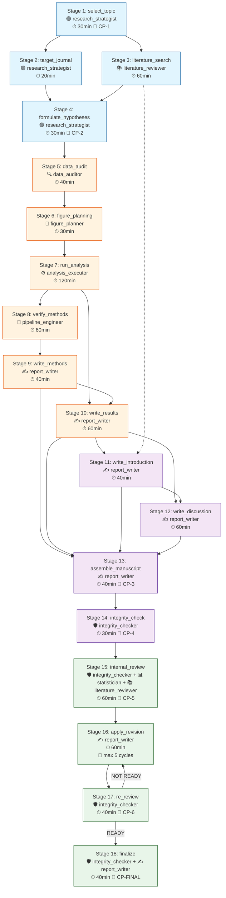

# Paper Writing Team v2.0

> **Status**: ACTIVE | **Version**: 2.0.0 | **Last Updated**: 2026-06-18
> **Purpose**: Full-cycle research manuscript production -- from blank idea to submission-ready PDF.
> **Agent Count**: 9 domain agents + 1 coordinator = 10 total.
> **Pipeline Stages**: 18 stages across 4 layers (Strategy / Execution / Decision / Supervision).
> **Coordination Model**: team_orchestrator dispatches, agents execute within bounded contracts, human-in-the-loop at 6 critical checkpoints.

---

## 1. Agent Roster

### 1.1 Coordinator

| Attribute | Value |
|-----------|-------|
| **Agent ID** | `team_orchestrator` |
| **Role** | Multi-Agent Coordinator & Pipeline Conductor |
| **Layer** | Cross-cutting (all phases) |
| **Responsibility** | Task decomposition, agent dispatch, parallel scheduling, deadlock detection, progress tracking, human checkpoint routing, revision orchestration |
| **Skills** | `paper_loop` |
| **Tool Permissions** | `TaskCreate`, `TaskUpdate`, `TaskGet`, `TaskList`, `Read` |
| **Max Parallel Subagents** | 6 |
| **Fallback** | Self (no higher authority) |

### 1.2 Domain Agents (9)

#### Agent 1: `research_strategist`
| Attribute | Value |
|-----------|-------|
| **Role** | Research Design & Strategy |
| **Phases** | 1 (Research & Planning) |
| **Stages** | Stage 1: select_topic, Stage 2: target_journal, Stage 4: formulate_hypotheses |
| **Expertise** | Research question formulation, feasibility assessment, journal targeting, hypothesis generation, study design (PICO framework), power analysis requirements |
| **Input Contract** | `research_idea: str`, `domain: str`, optional: `journal_preference: str`, `constraints: dict` |
| **Output Contract** | `research_question: str`, `feasibility_report: dict{4 dimensions}`, `hypotheses: list[Hypothesis]`, `journal_profile: dict`, `formatting_requirements: dict` |
| **Skills** | `topic_research`, `literature_search` |
| **MCP Tools** | `grok-search:web_search`, `pubmed:search_articles`, `consensus:search` |
| **Banned Tools** | `Bash(Rscript **)`, `Bash(python **)` -- no code execution |
| **Max Parallel Subagents** | 1 |

**Trigger Patterns**: "Define research question", "Assess feasibility", "Select target journal", "Design study", "Formulate hypothesis", "Scope research", "PICO framework"

---

#### Agent 2: `literature_reviewer`
| Attribute | Value |
|-----------|-------|
| **Role** | Literature Search & Evidence Synthesis |
| **Phases** | 1 (Research & Planning), 4 (Assembly & Review -- cross-validation) |
| **Stages** | Stage 3: literature_search |
| **Expertise** | Systematic literature search, citation management, evidence synthesis, gap analysis, bibliography formatting, PRISMA compliance |
| **Input Contract** | `search_query: str`, `domain: str`, optional: `date_range: tuple`, `max_results: int`, `database_preferences: list[str]` |
| **Output Contract** | `citation_library: .bib`, `literature_synthesis: .md`, `search_strategy: .md`, `citation_evidence: .jsonl` |
| **Skills** | `literature_search` |
| **MCP Tools** | `pubmed:search_articles`, `pubmed:get_article_metadata`, `pubmed:find_related_articles`, `consensus:search`, `exa:web_search_exa`, `exa:web_fetch_exa`, `grok-search:web_search`, `grok-search:web_fetch` |
| **Banned Tools** | `Bash(Rscript **)`, `Bash(python **)` -- no code execution |
| **Max Parallel Subagents** | 2 |

**Trigger Patterns**: "Search literature", "Find papers", "Build bibliography", "Systematic review", "Citation management", "Literature synthesis"

---

#### Agent 3: `data_auditor`
| Attribute | Value |
|-----------|-------|
| **Role** | Data Quality Audit & Metadata Validation |
| **Phases** | 2 (Data & Methods) |
| **Stages** | Stage 5: data_audit |
| **Expertise** | Data quality assessment, metadata validation, missing data analysis, batch effect detection, outlier detection, format validation |
| **Input Contract** | `data_paths: list[str]`, `expected_schema: dict`, optional: `metadata_paths: list[str]` |
| **Output Contract** | `data_audit_report: .md`, `metadata_validation: .yaml`, `qc_metrics: .json` |
| **Skills** | `qc_pipeline`, `reproducibility` |
| **Tool Permissions** | `Bash(Rscript **)`, `Bash(python **)`, `Read`, `Grep`, `Glob` |
| **Banned Tools** | `Write` -- read-only audit, never modifies data |
| **Max Parallel Subagents** | 1 |

**Trigger Patterns**: "Audit data", "Check data quality", "Validate metadata", "QC raw data", "Assess missing values", "Detect batch effects"

---

#### Agent 4: `figure_planner`
| Attribute | Value |
|-----------|-------|
| **Role** | Figure Architecture & Visual Design |
| **Phases** | 2 (Data & Methods) |
| **Stages** | Stage 6: figure_planning |
| **Expertise** | Figure architecture, panel composition, color scheme design, evidence-flow visualization, journal figure compliance, colorblind accessibility |
| **Input Contract** | `analysis_results_summary: dict`, `journal_requirements: dict`, optional: `existing_figures: list[str]`, `style_preferences: dict` |
| **Output Contract** | `figure_plan: .md` (mapping claims to panels), `figure_specs: .yaml` (dimensions, DPI, color palette), `color_palette: .yaml` (WCAG-AA verified) |
| **Skills** | `figure_planning` |
| **Tool Permissions** | `nature-figure`, `Read` |
| **Banned Tools** | `Bash(Rscript **)`, `Bash(python **)` -- design only, no generation |
| **Max Parallel Subagents** | 1 |

**Standard Figure Architecture** (6 figures for original_research):
| Figure | Purpose | Typical Panels |
|--------|---------|----------------|
| Figure 1 | Study overview + data characteristics | Study flowchart, QC metrics, sample distribution |
| Figure 2 | Molecular landscape | Global patterns, PCA/UMAP, heatmap overview |
| Figure 3 | Differential analysis | Volcano plot, heatmap, top DEGs bar chart |
| Figure 4 | Pathway & functional analysis | Enrichment dot plot, network, GSEA ridge |
| Figure 5 | Mechanism & interactions | PPI network, module-trait, hub gene characterization |
| Figure 6 | Validation & clinical associations | External validation, ROC curves, survival analysis |

**Trigger Patterns**: "Plan figures", "Design panels", "Choose colors", "Figure layout", "Graphical abstract", "Visualize results"

---

#### Agent 5: `analysis_executor`
| Attribute | Value |
|-----------|-------|
| **Role** | Data Analysis Execution |
| **Phases** | 2 (Data & Methods) |
| **Stages** | Stage 7: run_analysis |
| **Expertise** | Bioinformatics pipelines, statistical analysis, machine learning, multi-omics integration, spatial analysis, pathway analysis |
| **Input Contract** | `analysis_spec: dict`, `input_data_paths: list[str]`, optional: `parameter_overrides: dict`, `output_directory: str` |
| **Output Contract** | `result_tables: list[.csv]`, `figures: list[.pdf]`, `analysis_log: .txt`, `analysis_scripts: list[.{R,py}]`, `session_info: .txt` |
| **Skills** | `statistical_testing`, `spatial_analysis`, `pathway_inference`, `multi_omics` |
| **Tool Permissions** | `Bash(Rscript **)`, `Bash(python **)`, `Read`, `Write`, `Glob`, `Grep`, `mcp__context7__query-docs` |
| **Max Parallel Subagents** | 2 |
| **Timeout** | 14400s (4 hours) -- longest of any agent |

**Trigger Patterns**: "Run analysis", "Execute pipeline", "Perform DE analysis", "Run WGCNA", "Machine learning model", "Statistical test", "Generate results"

---

#### Agent 6: `pipeline_engineer`
| Attribute | Value |
|-----------|-------|
| **Role** | Pipeline Engineering & Reproducibility |
| **Phases** | 2 (Data & Methods) |
| **Stages** | Stage 8: verify_methods |
| **Expertise** | Pipeline orchestration, environment management (conda/renv/Docker), dependency pinning, workflow automation, CI/CD for research |
| **Input Contract** | `pipeline_spec: dict`, `environment_requirements: dict`, optional: `existing_pipelines: list[str]`, `platform_constraints: dict` |
| **Output Contract** | `reproducibility_report: .md`, `environment_snapshot: .yaml`, `dockerfile_check: .md` (or `Dockerfile` if missing) |
| **Skills** | `reproducibility`, `qc_pipeline` |
| **Tool Permissions** | `Bash(docker **)`, `Bash(conda **)`, `Bash(pip **)`, `Bash(python **)`, `Bash(R **)`, `Read`, `Write`, `Glob` |
| **Max Parallel Subagents** | 1 |

**Trigger Patterns**: "Build pipeline", "Containerize", "Set up environment", "Manage dependencies", "Automate workflow", "Docker", "Conda environment"

---

#### Agent 7: `statistician`
| Attribute | Value |
|-----------|-------|
| **Role** | Statistical Consulting & Cross-Validation |
| **Phases** | 2 (Methods verification), 3 (Results cross-validation), 4 (Review) |
| **Stages** | Cross-cuts Stage 7 (run_analysis) and Stage 10 (write_results); active reviewer in Stage 15 (internal_review) |
| **Expertise** | Study design review, statistical test selection, power analysis, model diagnostics, multiple testing correction, effect size interpretation |
| **Input Contract** | `study_design: dict`, `data_structure: dict`, `research_question: str`, optional: `existing_analysis_output: dict` |
| **Output Contract** | `statistical_review: .md` (per-stage audit), `recommendations: .md` (test choices, corrections needed) |
| **Skills** | `statistical_testing` |
| **Tool Permissions** | `Bash(Rscript **)`, `Bash(python **)`, `Read`, `mcp__context7__query-docs` |
| **Banned Tools** | `Write` -- advisory only, never modifies data or manuscript |
| **Max Parallel Subagents** | 1 |

**Cross-Validation Schedule**:
| When | What | Output |
|------|------|--------|
| After `run_analysis` (Stage 7) | Audit: test selection, p-values, effect sizes, multiple testing correction | `stats_audit_analysis.md` |
| After `write_results` (Stage 10) | Verify: every statistical claim matches analysis output | `stats_audit_results.md` |
| During `internal_review` (Stage 15) | Full statistical review as reviewer persona | `reviewer_stats_report.md` |

**Trigger Patterns**: "Check statistics", "Validate statistical methods", "Power analysis", "Sample size calculation", "Choose statistical test", "Review p-values", "Effect size interpretation"

---

#### Agent 8: `report_writer`
| Attribute | Value |
|-----------|-------|
| **Role** | Manuscript Writing & Assembly |
| **Phases** | 3 (Writing), 4 (Assembly), 5 (Revision), 6 (Finalize) |
| **Stages** | Stage 9: write_methods, Stage 10: write_results, Stage 11: write_introduction, Stage 12: write_discussion, Stage 13: assemble_manuscript, Stage 16: apply_revision, Stage 18: finalize |
| **Expertise** | Scientific writing (IMRAD), journal formatting, citation integration, figure legend writing, abstract composition, cover letter drafting |
| **Input Contract** | `analysis_results: dict`, `figures: list[str]`, `paper_config: dict`, optional: `existing_draft: str`, `writing_style_guide: dict` |
| **Output Contract** | `manuscript_sections: dict[section_name -> .md]`, `claims_evidence_table: .csv`, `cover_letter: .md`, `abstract: .md` |
| **Skills** | `paper_writing`, `revision_routing` |
| **Tool Permissions** | `academic-paper`, `scientific-writing`, `nature-writing`, `nature-polishing`, `Read`, `Write` |
| **Banned Tools** | `Bash(Rscript **)`, `Bash(python **)` -- no analysis, writing only |
| **Max Parallel Subagents** | 1 |

**Writing Standards Enforced**:
- Objective language: "showed/demonstrated/indicated" (not "interesting/remarkable")
- Exact p-values with effect sizes and confidence intervals
- No bullet points in body text (prose paragraphs only)
- Every claim bound to figure/table reference in `claims_evidence_table.csv`
- Methods: all parameters, software versions, random seeds documented
- Discussion: mandatory Limitations paragraph (>=100 words, >=3 distinct limitations)
- No "first/novel" without extraordinary evidence
- Past tense for Methods and Results; present tense for established knowledge

**Trigger Patterns**: "Write", "Draft", "Compose", "Assemble manuscript", "Format for journal", "Write abstract/introduction/methods/results/discussion"

---

#### Agent 9: `integrity_checker`
| Attribute | Value |
|-----------|-------|
| **Role** | Quality Assurance & Integrity Gate Enforcement |
| **Phases** | 4 (Assembly -- gate enforcement), 5 (Re-review), 6 (Final quality) |
| **Stages** | Stage 14: integrity_check, Stage 15: internal_review, Stage 17: re_review |
| **Expertise** | Gate enforcement (16 rules), citation verification, claim-evidence binding audit, reproducibility audit, journal compliance, writing standards enforcement |
| **Input Contract** | `manuscript: dict[section -> str]`, `artifacts: dict`, `paper_config: dict`, optional: `previous_integrity_report: dict` |
| **Output Contract** | `integrity_report: .yaml + .md`, `gate_statuses: dict[gate_id -> PASS/FAIL]`, `failure_details: .jsonl` |
| **Skills** | `qc_pipeline`, `reproducibility` |
| **Tool Permissions** | `academic-paper-reviewer`, `Read`, `Grep`, `Glob`, `pubmed:convert_article_ids`, `pubmed:get_article_metadata` |
| **Banned Tools** | `Write`, `Bash(Rscript **)`, `Bash(python **)` -- CHECK ONLY, never modifies |
| **Max Parallel Subagents** | 1 |

**Gate Severity Hierarchy** (16 gates):
| Severity | Count | Gate IDs | Pipeline Behavior |
|----------|-------|----------|-------------------|
| **CRITICAL** | 5 | g01-g05 | BLOCK pipeline until resolved |
| **HIGH** | 8 | g06-g10, g13-g14, g16 | WARN; must document if not fixed |
| **MEDIUM** | 3 | g11-g12, g15 | Advisory; logged, no block |

**CRITICAL Gates** (g01-g05):
| Gate | Rule | Check Method |
|------|------|-------------|
| g01 | Citation Traceability -- every cite has BibTeX entry + evidence record | Cross-reference citation keys |
| g02 | Citation Integrity -- verify DOIs/PMIDs exist; no fabrications | External MCP validation |
| g03 | Results No Citations -- Results section must not cite external literature | Pattern match `\cite{`, `[@`, `[1]` |
| g04 | Claim-Artifact Binding -- every factual claim traceable to figure/table/stat output | Semantic analysis + claims table |
| g05 | Figure References -- all figures referenced in text, sequential order, all refs point to real files | Cross-reference figures/ dir vs. text |

**HIGH Gates** (g06-g10, g13-g14, g16):
| Gate | Rule |
|------|------|
| g06 | Data Availability -- statement present, accessions/DOIs provided |
| g07 | Code Availability -- public repo, DOI, README, LICENSE, environment file |
| g08 | No Local Paths -- zero absolute/hardcoded paths in scripts or manuscript |
| g09 | Parameters Complete -- >=95% of analysis parameters documented in Methods |
| g10 | Limitations Discussed -- dedicated paragraph, >=100 words, >=3 limitations |
| g13 | Statistics Reported -- exact p-values, effect sizes, CIs; no bare "p<0.05" |
| g14 | No Overinterpretation -- no "proves/definitively/first-ever/paradigm shift" |
| g16 | Pseudoreplication Check -- unit of analysis matches biological unit of replication |

**MEDIUM Gates** (g11-g12, g15):
| Gate | Rule |
|------|------|
| g11 | Section Length -- each section meets minimum word count per paper type |
| g12 | No Bullets in Prose -- manuscript body uses paragraphs only |
| g15 | Journal Format -- citation style, section order, word/figure limits match target journal |

**Trigger Patterns**: "Check integrity", "Verify manuscript", "Run quality gates", "Validate citations", "Check compliance", "Audit manuscript"

---

## 2. 18-Stage Workflow

### Layer Architecture

```
┌─────────────────────────────────────────────────────────────────┐
│  STRATEGY LAYER (Stages 1-4)                                     │
│  What to study, where to publish, what's known, what to test     │
│  Agents: research_strategist, literature_reviewer                │
├─────────────────────────────────────────────────────────────────┤
│  EXECUTION LAYER (Stages 5-10)                                   │
│  Audit data, plan figures, run analysis, verify, write methods   │
│  Agents: data_auditor, figure_planner, analysis_executor,         │
│          pipeline_engineer, report_writer                        │
├─────────────────────────────────────────────────────────────────┤
│  DECISION LAYER (Stages 11-14)                                   │
│  Write results/intro/discussion, assemble, integrity check       │
│  Agents: report_writer, integrity_checker                        │
├─────────────────────────────────────────────────────────────────┤
│  SUPERVISION LAYER (Stages 15-18)                                │
│  Internal review, revise, re-review, finalize                    │
│  Agents: integrity_checker, report_writer, statistician          │
└─────────────────────────────────────────────────────────────────┘
```

### Stage Details

---

#### STAGE 1: `select_topic` -- Topic Selection & Feasibility Assessment

| Attribute | Value |
|-----------|-------|
| **Layer** | Strategy |
| **Order** | 1 |
| **Agent** | `research_strategist` |
| **Skills** | `topic_research` |
| **Dependencies** | None (entry point) |
| **Parallel Group** | None |
| **Timeout** | 1800s (30 min) |
| **Retry** | Max 2, backoff 1.5x |
| **Human Checkpoint** | YES |

**Inputs**: User-provided research idea, domain keywords, optional journal preference.

**Actions**:
1. Refine research idea into structured research question
2. Perform preliminary literature scan for novelty assessment
3. Construct PICO framework (Population, Intervention/Exposure, Comparison, Outcome)
4. 4-dimension feasibility assessment: data availability, methodological capability, timeline, significance
5. Go/No-Go recommendation with confidence level

**Artifacts Produced**:
```
papers/{paper_id}/strategy/
├── research_question.md          # Structured research question + PICO
├── feasibility_report.md         # 4-dimension assessment + Go/No-Go
└── pico_framework.yaml           # Machine-readable PICO
```

**Gate Rules Applied**: g01 (citation traceability) -- preliminary citations must be traceable.

**Checkpoint Prompt**: "Confirm research question and feasibility assessment. Review PICO framework. Approve Go/No-Go decision before proceeding to journal targeting and literature search."

---

#### STAGE 2: `target_journal` -- Journal Targeting & Requirements Analysis

| Attribute | Value |
|-----------|-------|
| **Layer** | Strategy |
| **Order** | 2 |
| **Agent** | `research_strategist` |
| **Skills** | `topic_research` |
| **Dependencies** | Stage 1: select_topic |
| **Parallel** | Can run in parallel with Stage 3 (literature_search) |
| **Timeout** | 1200s (20 min) |
| **Retry** | Max 2, backoff 1.5x |
| **Human Checkpoint** | No |

**When stage 1 completes**, research_strategist spawns simultaneously:
- Stage 2: Analyze journal options
- Stage 3 (dispatched to literature_reviewer): Systematic literature search

**Actions**:
1. Query journal database (`config/journal_database.yaml`) for candidate journals
2. Score match: scope alignment, impact factor tier, acceptance rate, turnaround time
3. Fetch current Guide for Authors (via `grok-search:web_search`)
4. Compile formatting requirements: word limits, figure limits, citation style, section requirements
5. Generate submission checklist

**Artifacts Produced**:
```
papers/{paper_id}/strategy/
├── journal_profile.md            # Matched journal analysis
├── formatting_requirements.yaml  # Extracted formatting rules
└── submission_checklist.md       # Pre-submission checklist
```

**Gate Rules Applied**: g15 (journal format) -- verify journal requirements are correctly extracted.

---

#### STAGE 3: `literature_search` -- Systematic Literature Search & Synthesis

| Attribute | Value |
|-----------|-------|
| **Layer** | Strategy |
| **Order** | 3 |
| **Agent** | `literature_reviewer` |
| **Skills** | `literature_search` |
| **Dependencies** | Stage 1: select_topic |
| **Parallel** | Can run in parallel with Stage 2 (target_journal) |
| **Timeout** | 3600s (60 min) |
| **Retry** | Max 3, backoff 2.0x |
| **Human Checkpoint** | No |

**Actions**:
1. Construct search strategy with MeSH terms + free-text keywords
2. Execute across PubMed, Consensus, Semantic Scholar
3. Deduplicate results; screen titles/abstracts
4. Extract key findings into evidence matrix
5. Identify knowledge gaps (what's NOT known -- critical for Introduction framing)
6. Build `.bib` library with verified DOIs/PMIDs
7. Generate `citation_evidence.jsonl` mapping each paper to the claim it supports

**Artifacts Produced**:
```
papers/{paper_id}/references/
├── literature_search_strategy.md   # PRISMA-compatible search strategy
├── citation_library.bib            # Complete BibTeX library
├── literature_synthesis.md         # Thematic synthesis of findings
└── citation_evidence.jsonl         # Paper -> claim -> evidence strength
```

**Gate Rules Applied**: g01 (citation traceability).

**Quality Checks**:
- Each citation must have DOI or PMID
- Cross-verify >=2 sources for key factual claims
- Flag single-source claims explicitly

---

#### STAGE 4: `formulate_hypotheses` -- Hypothesis Formulation & Study Design

| Attribute | Value |
|-----------|-------|
| **Layer** | Strategy |
| **Order** | 4 |
| **Agent** | `research_strategist` |
| **Skills** | `topic_research`, `statistical_testing` |
| **Dependencies** | Stage 2: target_journal AND Stage 3: literature_search |
| **Parallel** | None (merge point after parallel Stages 2+3) |
| **Timeout** | 1800s (30 min) |
| **Retry** | Max 2, backoff 1.5x |
| **Human Checkpoint** | YES |

**Actions**:
1. Synthesize literature gaps into testable hypotheses (H1, H2, H3, ...)
2. Define primary vs. secondary hypotheses
3. Design study: sample size justification, statistical power analysis
4. Pre-specify analysis plan (prevents p-hacking)
5. Define success criteria (what result would support vs. refute each hypothesis)

**Artifacts Produced**:
```
papers/{paper_id}/strategy/
├── hypotheses.yaml                # Structured hypotheses with test plans
├── study_design.md                # Full study design document
└── power_analysis.md              # Sample size + power calculations
```

**Gate Rules Applied**: g13 (statistics reported) -- power analysis must be documented.

**Checkpoint Prompt**: "Review and approve hypotheses and study design. Confirm: (1) hypotheses are testable with available data, (2) statistical power is adequate, (3) analysis plan is pre-specified. This is the last checkpoint before data analysis begins."

---

#### STAGE 5: `data_audit` -- Data Quality Audit & Metadata Validation

| Attribute | Value |
|-----------|-------|
| **Layer** | Execution |
| **Order** | 5 |
| **Agent** | `data_auditor` |
| **Skills** | `qc_pipeline` |
| **Dependencies** | Stage 4: formulate_hypotheses |
| **Parallel** | None |
| **Timeout** | 2400s (40 min) |
| **Retry** | Max 2, backoff 1.5x |
| **Human Checkpoint** | No |

**Actions**:
1. Validate data format against expected schema
2. Compute QC metrics: completeness, distribution checks, outlier detection
3. Check for batch effects (PCA by batch variable)
4. Validate metadata (sample IDs match, groups balanced)
5. Flag issues: missing values, outliers, batch effects, low-quality samples

**Artifacts Produced**:
```
papers/{paper_id}/qc/
├── data_audit_report.md           # Full audit findings
├── metadata_validation.yaml       # Validation results per sample
└── qc_metrics.json                # Machine-readable QC metrics
```

**Gate Rules Applied**: g06 (data availability), g16 (pseudoreplication).

**Critical Rule**: data_auditor CANNOT modify data. Issues are flagged; user decides on exclusion/correction.

---

#### STAGE 6: `figure_planning` -- Figure & Table Planning

| Attribute | Value |
|-----------|-------|
| **Layer** | Execution |
| **Order** | 6 |
| **Agent** | `figure_planner` |
| **Skills** | `figure_planning` |
| **Dependencies** | Stage 5: data_audit |
| **Parallel** | Runs in `group_a` with Stage 7; figure_planning finishes first to feed specs to analysis |
| **Timeout** | 1800s (30 min) |
| **Retry** | Max 2, backoff 1.5x |
| **Human Checkpoint** | No |

**Actions**:
1. Map key claims to figure panels (evidence-flow design)
2. Define panel composition for each figure (Figure 1-6 standard structure)
3. Select color palette (WCAG-AA colorblind-friendly verification)
4. Specify: dimensions, DPI (300 minimum), format (PDF/SVG for vector, TIFF for raster)
5. Identify missing analyses needed to complete figure story

**Artifacts Produced**:
```
papers/{paper_id}/figures/
├── figure_plan.md                 # Narrative + panel descriptions
├── figure_specs.yaml              # Machine-readable specs per figure
└── color_palette.yaml             # Hex codes, colorblind check results
```

**Gate Rules Applied**: g05 (figure references), g14 (figure count limits per journal).

---

#### STAGE 7: `run_analysis` -- Execute Data Analysis Pipeline

| Attribute | Value |
|-----------|-------|
| **Layer** | Execution |
| **Order** | 7 |
| **Agent** | `analysis_executor` |
| **Skills** | `statistical_testing`, `spatial_analysis`, `pathway_inference`, `multi_omics` (dispatched based on domain) |
| **Dependencies** | Stage 6: figure_planning |
| **Parallel** | None (but statistician cross-validates output asynchronously) |
| **Timeout** | 7200s (2 hours) -- expandable to 14400s |
| **Retry** | Max 3, backoff 2.0x |
| **Human Checkpoint** | No |

**Actions**:
1. Read `figure_specs.yaml` to know what output is needed
2. Execute analysis scripts (R/Python) with fixed random seeds
3. Generate all result tables and figures per spec
4. Log: commands used, software versions, parameters, runtime
5. Export `session_info.txt` (R) or `pip freeze` (Python)

**Artifacts Produced**:
```
papers/{paper_id}/results/
├── tables/
│   ├── differential_expression.csv
│   ├── enrichment_results.csv
│   ├── module_assignment.csv
│   └── ...
├── figures/
│   ├── figure1_panelA.pdf
│   ├── figure2_heatmap.pdf
│   └── ...
├── analysis_log.txt               # Timestamped execution log
├── session_info.txt               # Software versions
└── parameter_manifest.yaml        # All parameters used
```

**Gate Rules Applied**: g03, g04, g08, g09, g13.

**Statistician Cross-Validation** (triggered asynchronously after this stage):
- `statistician` receives `analysis_log.txt` + result tables
- Produces `stats_audit_analysis.md`: test selection correctness, p-value reporting, effect size completeness, multiple testing correction

---

#### STAGE 8: `verify_methods` -- Methods Verification & Reproducibility Check

| Attribute | Value |
|-----------|-------|
| **Layer** | Execution |
| **Order** | 8 |
| **Agent** | `pipeline_engineer` |
| **Skills** | `reproducibility` |
| **Dependencies** | Stage 7: run_analysis |
| **Parallel** | None |
| **Timeout** | 3600s (60 min) |
| **Retry** | Max 2, backoff 1.5x |
| **Human Checkpoint** | No |

**Actions**:
1. Replay analysis in isolated environment (conda/renv from lockfile)
2. Compare output checksums against original run
3. Check: all random seeds set and documented
4. Check: no hardcoded absolute paths (g08)
5. Verify Dockerfile or environment.yml exists and is complete
6. Generate reproducibility report

**Artifacts Produced**:
```
papers/{paper_id}/reproducibility/
├── reproducibility_report.md      # Replay results
├── environment_snapshot.yaml      # Full env snapshot
└── dockerfile_check.md            # Docker audit
```

**Gate Rules Applied**: g07 (code availability), g09 (parameters complete).

---

#### STAGE 9: `write_methods` -- Write Methods Section

| Attribute | Value |
|-----------|-------|
| **Layer** | Execution |
| **Order** | 9 |
| **Agent** | `report_writer` |
| **Skills** | `paper_writing` |
| **Dependencies** | Stage 8: verify_methods |
| **Parallel** | None |
| **Timeout** | 2400s (40 min) |
| **Retry** | Max 3, backoff 1.5x |
| **Human Checkpoint** | No |

**Actions**:
1. Extract all parameters from `parameter_manifest.yaml` and analysis scripts
2. Write subsections: Study Design, Data Sources, Data Preprocessing, Statistical Analysis, Code/Data Availability
3. Embed: software names + versions, key parameter values, random seeds
4. Ensure sufficient detail for independent reproduction
5. Generate Data Availability Statement

**Artifacts Produced**:
```
papers/{paper_id}/manuscript/
├── methods.md                     # Methods section
├── methods_parameter_table.csv    # All parameters in tabular form
└── data_availability_statement.md # Data availability statement
```

**Gate Rules Applied**: g09, g10, g11, g12.

---

#### STAGE 10: `write_results` -- Write Results Section

| Attribute | Value |
|-----------|-------|
| **Layer** | Execution |
| **Order** | 10 |
| **Agent** | `report_writer` |
| **Skills** | `paper_writing` |
| **Dependencies** | Stage 7: run_analysis AND Stage 9: write_methods |
| **Parallel** | Can draft while Stages 11, 12 are in early drafting |
| **Timeout** | 3600s (60 min) |
| **Retry** | Max 3, backoff 1.5x |
| **Human Checkpoint** | No |

**Actions**:
1. Write results organized by figure (each subsection = one figure's findings)
2. Report exact values: log2FC, p-values, FDR, effect sizes with CI
3. Generate `claims_evidence_table.csv`: claim text -> supporting figure/table -> evidence strength
4. Zero external citations (enforced by g03)
5. Call out each figure/table at appropriate point in text

**Artifacts Produced**:
```
papers/{paper_id}/manuscript/
├── results.md                     # Results section
└── claims_evidence_table.csv      # Claim -> artifact binding
```

**Gate Rules Applied**: g03, g04, g11, g12.

**Statistician Cross-Validation** (triggered asynchronously):
- `statistician` receives `results.md` + `claims_evidence_table.csv`
- Produces `stats_audit_results.md`: every statistical claim matches analysis output

---

#### STAGE 11: `write_introduction` -- Write Introduction Section

| Attribute | Value |
|-----------|-------|
| **Layer** | Decision |
| **Order** | 11 |
| **Agent** | `report_writer` |
| **Skills** | `paper_writing` |
| **Dependencies** | Stage 3: literature_search AND Stage 10: write_results |
| **Parallel** | Can draft literature review portion while Stage 10 is in progress |
| **Timeout** | 2400s (40 min) |
| **Retry** | Max 3, backoff 1.5x |
| **Human Checkpoint** | No |

**Actions**:
1. Structure: Broad context (1 para) -> Knowledge gap (1-2 para) -> Research question (1 para) -> Hypothesis + Objectives (final para)
2. Integrate citations from `literature_synthesis.md` and `citation_evidence.jsonl`
3. Last paragraph must explicitly state objectives and hypotheses
4. No results or conclusions in Introduction

**Artifacts Produced**:
```
papers/{paper_id}/manuscript/
└── introduction.md                # Introduction section
```

**Gate Rules Applied**: g01, g11, g12.

---

#### STAGE 12: `write_discussion` -- Write Discussion Section

| Attribute | Value |
|-----------|-------|
| **Layer** | Decision |
| **Order** | 12 |
| **Agent** | `report_writer` |
| **Skills** | `paper_writing` |
| **Dependencies** | Stage 10: write_results AND Stage 11: write_introduction |
| **Parallel** | Can draft literature comparison while Stage 11 is finalized |
| **Timeout** | 3600s (60 min) |
| **Retry** | Max 3, backoff 1.5x |
| **Human Checkpoint** | No |

**Actions**:
1. Structure: Summary of findings -> Contextualization in literature -> Interpretation -> **Limitations** (>=100 words, >=3 distinct) -> Implications -> Future directions
2. Do not repeat Results verbatim
3. Compare with existing literature explicitly (cite specific papers)
4. Distinguish correlation from causation explicitly
5. Label mechanistic hypotheses clearly as unverified
6. Acknowledge uncertainty and generalizability limits

**Artifacts Produced**:
```
papers/{paper_id}/manuscript/
└── discussion.md                  # Discussion section
```

**Gate Rules Applied**: g02, g10, g11, g12, g14.

---

#### STAGE 13: `assemble_manuscript` -- Assemble Full Manuscript

| Attribute | Value |
|-----------|-------|
| **Layer** | Decision |
| **Order** | 13 |
| **Agent** | `report_writer` |
| **Skills** | `paper_writing` |
| **Dependencies** | Stages 9, 10, 11, 12: ALL writing stages complete |
| **Parallel** | None (merge point) |
| **Timeout** | 2400s (40 min) |
| **Retry** | Max 2, backoff 1.5x |
| **Human Checkpoint** | YES |

**Actions**:
1. Concatenate all sections (Title, Abstract, Introduction, Methods, Results, Discussion, Conclusions, References, Data Availability, Code Availability)
2. Generate Abstract from key findings
3. Cross-check: all figure/table references resolve to real files
4. Generate DOCX (via Pandoc) and LaTeX source
5. Verify reference numbering consistency
6. Compile supplementary materials index

**Artifacts Produced**:
```
papers/{paper_id}/manuscript/
├── manuscript_full.md             # Complete manuscript (Markdown)
├── manuscript_full.tex            # LaTeX source
├── manuscript_full.docx           # DOCX for co-author review
├── abstract.md                    # Standalone abstract
├── title_page.md                  # Title + authors + affiliations
└── supplementary_index.md         # Supplementary materials index
```

**Gate Rules Applied**: g14, g15.

**Checkpoint Prompt**: "Review the assembled manuscript. Check: (1) all sections logically flow, (2) figure/table references are correct, (3) abstract accurately summarizes findings, (4) author list and affiliations are correct. Approve before integrity check."

---

#### STAGE 14: `integrity_check` -- Run Full Integrity Gate Suite

| Attribute | Value |
|-----------|-------|
| **Layer** | Decision |
| **Order** | 14 |
| **Agent** | `integrity_checker` |
| **Skills** | `qc_pipeline` |
| **Dependencies** | Stage 13: assemble_manuscript |
| **Parallel** | None |
| **Timeout** | 1800s (30 min) |
| **Retry** | Max 2, backoff 1.5x |
| **Human Checkpoint** | YES |

**Actions**:
1. Run all 16 integrity gates against assembled manuscript
2. Classify failures by severity (CRITICAL / HIGH / MEDIUM)
3. For each failure: location, issue, recommendation, auto-fix availability
4. Generate human-readable report + machine-readable JSON

**Artifacts Produced**:
```
papers/{paper_id}/integrity/
├── integrity_report.md            # Human-readable report
├── integrity_report.yaml          # Machine-readable status
└── gate_failures_detail.jsonl     # Per-failure details
```

**Gate Execution Order** (optimized for early failure detection):
1. g03 (Results no-citations) -- fastest, blocks if failed
2. g05 (Figure references) -- fast cross-reference
3. g01 (Citation traceability) -- cross-reference check
4. g02 (Citation integrity) -- external validation, slowest CRITICAL
5. g04 (Claim-artifact binding) -- semantic analysis
6. g11, g12 (Section length, no bullets) -- fast pattern match
7. g06, g07 (Data/code availability) -- content presence
8. g08, g09 (No local paths, parameters) -- pattern + diff
9. g10, g14 (Limitations, overinterpretation) -- semantic
10. g13 (Statistics reporting) -- pattern match
11. g16 (Pseudoreplication) -- semantic + code analysis
12. g15 (Journal format) -- spec validation

**Checkpoint Prompt**: "Review integrity report. CRITICAL failures MUST be resolved before proceeding. HIGH failures should be addressed or documented. Decide which issues to fix before internal review."

---

#### STAGE 15: `internal_review` -- Internal Peer Review Simulation

| Attribute | Value |
|-----------|-------|
| **Layer** | Supervision |
| **Order** | 15 |
| **Agent** | `integrity_checker` (orchestrates review), with `statistician` + `literature_reviewer` as reviewer personas |
| **Skills** | `paper_writing`, `revision_routing` |
| **Dependencies** | Stage 14: integrity_check (all CRITICAL gates must pass) |
| **Parallel** | Reviewers can run in parallel (statistician, literature reviewer, methods reviewer) |
| **Timeout** | 3600s (60 min) |
| **Retry** | Max 2, backoff 1.5x |
| **Human Checkpoint** | YES |

**Actions**:
1. Simulate 3+ independent reviewer personas:
   - **Reviewer 1 (Statistical)**: `statistician` -- methods rigor, test selection, reporting
   - **Reviewer 2 (Domain/Literature)**: `literature_reviewer` -- literature coverage, novelty assessment
   - **Reviewer 3 (General)**: `integrity_checker` -- clarity, structure, claims justification
   - **Devil's Advocate** (optional): `integrity_checker` -- most skeptical reading
2. Each reviewer produces independent report
3. Synthesize into unified `review_summary.md` with priority matrix
4. Generate `revision_priority_matrix.yaml`: P0 (must-fix) / P1 (should-fix) / P2 (optional)

**Artifacts Produced**:
```
papers/{paper_id}/review/
├── reviewer_reports/
│   ├── reviewer1_statistical.md
│   ├── reviewer2_literature.md
│   ├── reviewer3_general.md
│   └── reviewer4_devils_advocate.md
├── review_summary.md              # Synthesized feedback
└── revision_priority_matrix.yaml  # P0/P1/P2 prioritization
```

**Checkpoint Prompt**: "Review internal peer review reports. Decide which revisions to apply: (1) P0 must-fix items, (2) P1 should-fix items you choose to address, (3) P2 optional improvements. Approve revision plan before applying changes."

---

#### STAGE 16: `apply_revision` -- Apply Targeted Revisions

| Attribute | Value |
|-----------|-------|
| **Layer** | Supervision |
| **Order** | 16 |
| **Agent** | `report_writer` |
| **Skills** | `paper_writing`, `revision_routing` |
| **Dependencies** | Stage 15: internal_review |
| **Parallel** | None |
| **Timeout** | 3600s (60 min) |
| **Retry** | Max 3, backoff 2.0x |
| **Human Checkpoint** | No |

**Actions**:
1. Process `revision_priority_matrix.yaml`
2. Apply P0 fixes first, then approved P1 items
3. For each revision: record (original text -> revised text -> rationale)
4. Mark downstream stages as stale if revision affects results/methods
5. Re-run affected pipeline stages if data/analysis changed
6. Update `claims_evidence_table.csv` if claims changed

**Artifacts Produced**:
```
papers/{paper_id}/review/
├── revision_tracker.md            # Per-revision change log
├── change_log.yaml                # Machine-readable changes
└── commitment_ledger.csv          # Reviewer comment -> action taken -> verification status
```

**Gate Rules Applied**: g04 (claim-artifact binding re-check after revision), g11 (section length after revision).

**Revision Loop Limit**: Maximum 5 revision cycles. If more needed, escalate to human.

---

#### STAGE 17: `re_review` -- Post-Revision Re-Review

| Attribute | Value |
|-----------|-------|
| **Layer** | Supervision |
| **Order** | 17 |
| **Agent** | `integrity_checker` |
| **Skills** | `revision_routing`, `paper_writing` |
| **Dependencies** | Stage 16: apply_revision |
| **Parallel** | None |
| **Timeout** | 2400s (40 min) |
| **Retry** | Max 2, backoff 1.5x |
| **Human Checkpoint** | YES |

**Actions**:
1. Verify all P0 items resolved (zero tolerance for residual P0)
2. Verify P1 items addressed or explicitly documented as not fixed
3. Run regression check: did any fix introduce new issues?
4. Re-run integrity gates on revised manuscript (focused on changed sections)
5. Compare `commitment_ledger.csv` against revised manuscript
6. Produce final re-review verdict: READY / MINOR REMAINING / NOT READY

**Artifacts Produced**:
```
papers/{paper_id}/review/
├── re_review_report.md            # Re-review findings
└── regression_check.yaml          # Regression test results
```

**Gate Rules**: Re-run all CRITICAL + HIGH gates on affected sections.

**Checkpoint Prompt**: "Confirm re-review is satisfactory. Verify: (1) all P0 items resolved, (2) no regressions introduced, (3) manuscript is ready for finalization. Approve to proceed to final assembly."

---

#### STAGE 18: `finalize` -- Final Quality Check & Export

| Attribute | Value |
|-----------|-------|
| **Layer** | Supervision |
| **Order** | 18 |
| **Agent** | `integrity_checker` (quality), `report_writer` (assembly) |
| **Skills** | `reproducibility`, `paper_writing` |
| **Dependencies** | Stage 17: re_review (must be READY) |
| **Parallel** | None |
| **Timeout** | 2400s (40 min) |
| **Retry** | Max 2, backoff 1.5x |
| **Human Checkpoint** | YES (FINAL) |

**Actions**:
1. Final integrity gate pass (all 16 gates, full run)
2. Generate final PDF (LaTeX -> PDF via tectonic/pdflatex)
3. Generate final DOCX (for journal submission systems that require it)
4. Compile supplementary package (all supp figures, tables, methods)
5. Generate cover letter
6. Produce provenance report: full artifact chain with SHA-256 hashes
7. Package submission-ready bundle

**Artifacts Produced**:
```
papers/{paper_id}/submission/
├── manuscript_final.pdf           # Submission-ready PDF
├── manuscript_final.docx          # DOCX for submission systems
├── manuscript_final.tex           # LaTeX source
├── cover_letter.md                # Submission cover letter
├── supplementary_package.zip      # All supplementary materials
├── provenance_report.json         # Full artifact provenance
└── submission_checklist.md        # Journal-specific checklist
```

**Checkpoint Prompt (FINAL)**: "Final manuscript is ready for submission. Review: (1) PDF rendering, (2) cover letter, (3) all supplementary materials, (4) data/code availability statements, (5) author list and affiliations, (6) conflict of interest and funding statements. This is the last checkpoint before journal submission."

---

## 3. Task Dependency Graph

### 3.1 Mermaid Diagram



### 3.2 Dependency Matrix

```
Stage  Dependencies                    Wait-For                  Can Run Parallel With
─────  ─────────────────────────────  ────────────────────────  ───────────────────────────
  1    None                            (entry)                  None
  2    1                               1 complete               3
  3    1                               1 complete               2
  4    2, 3                            2 AND 3 complete         None (merge point)
  5    4                               4 complete               None
  6    5                               5 complete               None (feeds 7)
  7    6                               6 complete               Statistician async audit
  8    7                               7 complete               None
  9    8                               8 complete               None
 10    7, 9                            7 AND 9 complete         Statistician async audit
 11    3, 10                           3 AND 10 complete        12 (partial: lit comparison)
 12    10, 11                          10 AND 11 complete       (finalizes after 11)
 13    9, 10, 11, 12                   ALL writing complete     None (merge point)
 14    13                              13 complete              None
 15    14                              14 complete (CRITICAL    Reviewers can run in parallel
                                       gates must pass)
 16    15                              15 complete              None
 17    16                              16 complete              None
 18    17                              17 complete (READY       None
                                       verdict)

Legend:
  Hard dependency: stage N cannot start until all Wait-For conditions are met.
  Async: stage N can start but another agent cross-validates output independently.
```

### 3.3 Critical Path

```
S1 -> S3 -> S4 -> S5 -> S6 -> S7 -> S8 -> S9 -> S10 -> S12 -> S13 -> S14 -> S15 -> S16 -> S17 -> S18
```

Estimated total time on critical path (without human checkpoint delays): ~640 minutes (~10.7 hours) of agent execution time.

With human checkpoints (6 checkpoints, assume 15 min average response): ~730 minutes (~12.2 hours).

---

## 4. Parallel Execution Diagram

```
TIME ─────────────────────────────────────────────────────────────────────────────────────────────>

PHASE 1: STRATEGY (Stages 1-4)
  Agent: research_strategist       [S1: select_topic ████████████]
  Agent: research_strategist                [S2: target_journal ████████]
  Agent: literature_reviewer                [S3: literature_search ████████████████████████████]
  Agent: research_strategist                                        [S4: hypotheses ████████████]
                                                            ▲ CP-1              ▲ CP-2

PHASE 2: EXECUTION (Stages 5-10)
  Agent: data_auditor                [S5: data_audit ████████████████]
  Agent: figure_planner                             [S6: figure_plan ████████████]
  Agent: analysis_executor                                          [S7: run_analysis ████████████████████████████████████████████████]
  Agent: statistician          (async)                                               [stats_audit_analysis ████████]
  Agent: pipeline_engineer                                                                    [S8: verify ████████████████████████]
  Agent: report_writer                                                                                         [S9: methods ████████████████]
  Agent: report_writer                                                                                                       [S10: results ████████████████████████]
  Agent: statistician          (async)                                                                                        [stats_audit_results ████████]

PHASE 3: DECISION (Stages 11-14)                                                                                  ▲ CP-3? (moved to post-S13)
  Agent: report_writer                                                                     [S11: intro ████████████████]
  Agent: report_writer                                                                                       [S12: discussion ████████████████████████]
  Agent: report_writer                                                                                                               [S13: assemble ████████████████]
  Agent: integrity_checker                                                                                                                                 [S14: gates ████████████]
                                                                                                                                                  ▲ CP-4

PHASE 4: SUPERVISION (Stages 15-18)
  Agent: integrity_checker                                                                                                                                   [S15: review ████████████████████████]
  Agent: statistician       (reviewer)                                                                                                                       [R1: stats ████████████]
  Agent: literature_reviewer (reviewer)                                                                                                                      [R2: lit ████████████]
                                                                                                                                                    ▲ CP-5
  Agent: report_writer                                                                                                                                                         [S16: revise ████████████████████████]
  Agent: integrity_checker                                                                                                                                                                   [S17: re-review ████████████████]
                                                                                                                                                                                    ▲ CP-6
  Agent: integrity_checker + report_writer                                                                                                                                                     [S18: finalize ████████████████]
                                                                                                                                                                                    ▲ CP-FINAL

───── = Pipeline Stage execution
···· = Async/cross-validation (non-blocking)
  ▲   = Human Checkpoint (pipeline pauses until user approves)
```

### Parallelism Opportunities (Summary)

| Phase | Parallel Blocks | Benefit |
|-------|----------------|---------|
| Strategy | S2 \|\| S3 after S1 completes | Saves ~20 min |
| Execution | Statistician async audit during S7 and S10 | Zero added time -- audit in background |
| Decision | S11 literature review drafting while S10 finalizes | Saves ~15 min |
| Supervision | S15 reviewers (R1, R2, R3) run in parallel | Saves ~40 min |

Total estimated time saved via parallelism: ~75 minutes (from ~715 min sequential to ~640 min on critical path).

---

## 5. Checkpoint Configuration

### 5.1 Checkpoint Map

```
CP-1  [Stage 1 -> Stage 2+3]    Research Question & Feasibility
CP-2  [Stage 4 -> Stage 5]      Hypotheses & Study Design
CP-3  [Stage 13 -> Stage 14]    Assembled Manuscript Review
CP-4  [Stage 14 -> Stage 15]    Integrity Report Review
CP-5  [Stage 15 -> Stage 16]    Internal Review Feedback
CP-6  [Stage 17 -> Stage 18]    Re-Review Approval
CP-F  [Stage 18 Complete]       Final Manuscript Submission
```

### 5.2 Detailed Checkpoint Configuration

```yaml
checkpoints:
  # =========================================================================
  # CP-1: After Topic Selection & Feasibility (Stage 1 complete)
  # =========================================================================
  cp_01_research_question:
    stage_gate: "Stage 1 -> Stage 2+3"
    prompt: |
      ========================================
      CHECKPOINT 1: Research Question & Feasibility
      ========================================

      Please review the following before we proceed to journal targeting
      and systematic literature search:

      1. Research Question: {research_question}
      2. PICO Framework: {pico_framework}
      3. Feasibility Assessment: {feasibility_report}
      4. Go/No-Go Recommendation: {go_nogo}

      Confirm:
      - [ ] Research question is clear, specific, and answerable
      - [ ] PICO elements are well-defined
      - [ ] Feasibility concerns are acceptable
      - [ ] Go/No-Go decision is APPROVED

      Reply: APPROVED / NEEDS REVISION (specify what)
    timeout_seconds: 86400
    on_approve: "Proceed to Stage 2 (journal targeting) AND Stage 3 (literature search) in parallel."
    on_revise: "Return to Stage 1 with revision notes."
    on_reject: "Archive project with reason."

  # =========================================================================
  # CP-2: After Hypothesis Formulation (Stage 4 complete)
  # =========================================================================
  cp_02_hypotheses:
    stage_gate: "Stage 4 -> Stage 5"
    prompt: |
      ========================================
      CHECKPOINT 2: Hypotheses & Study Design
      ========================================

      Please review the proposed study design before we begin data analysis:

      1. Hypotheses: {hypotheses_summary}
      2. Study Design: {study_design_summary}
      3. Power Analysis: {power_analysis_summary}
      4. Pre-specified Analysis Plan: {analysis_plan_summary}

      Confirm:
      - [ ] All hypotheses are testable with available data
      - [ ] Statistical power is adequate (>=80% for primary endpoint)
      - [ ] Analysis plan is pre-specified (no post-hoc p-hacking risk)
      - [ ] Primary vs. secondary hypotheses are clearly distinguished

      WARNING: Changes to hypotheses AFTER this checkpoint will require
      re-running the analysis pipeline and may introduce p-hacking concerns.

      Reply: APPROVED / NEEDS REVISION (specify what)
    timeout_seconds: 86400
    on_approve: "Proceed to Stage 5 (data audit)."
    on_revise: "Return to Stage 4 with revision notes."
    on_reject: "Return to Stage 1 to reformulate research question."
    critical: true
    irreversible: "Analysis plan is locked after this checkpoint."

  # =========================================================================
  # CP-3: After Manuscript Assembly (Stage 13 complete)
  # =========================================================================
  cp_03_assembled_manuscript:
    stage_gate: "Stage 13 -> Stage 14"
    prompt: |
      ========================================
      CHECKPOINT 3: Assembled Manuscript Review
      ========================================

      The complete manuscript has been assembled. Please review before
      we run the integrity check suite:

      1. Manuscript: {manuscript_path}
      2. Abstract: {abstract_path}
      3. Figures: {figure_count} main + {supp_figure_count} supplementary
      4. Tables: {table_count}
      5. Word Counts: {word_counts_by_section}

      Confirm:
      - [ ] All sections logically flow from Introduction to Discussion
      - [ ] Figure/table references in text resolve to real files
      - [ ] Abstract accurately summarizes findings
      - [ ] Author list, affiliations, funding are correct
      - [ ] No missing sections or placeholder text

      Reply: APPROVED / NEEDS REVISION (specify section + issue)
    timeout_seconds: 86400
    on_approve: "Proceed to Stage 14 (integrity check)."
    on_revise: "Return to affected writing stage(s) with revision notes."

  # =========================================================================
  # CP-4: After Integrity Check (Stage 14 complete)
  # =========================================================================
  cp_04_integrity_report:
    stage_gate: "Stage 14 -> Stage 15"
    prompt: |
      ========================================
      CHECKPOINT 4: Integrity Report Review
      ========================================

      The 16-gate integrity suite has completed:

      CRITICAL Failures ({critical_count}): {critical_gates}
      HIGH Failures ({high_count}): {high_gates}
      MEDIUM Advisories ({medium_count}): {medium_gates}

      CRITICAL failures MUST be fixed before internal review.
      HIGH failures SHOULD be addressed or explicitly documented.
      MEDIUM items are advisory.

      Confirm:
      - [ ] All CRITICAL failures resolved (or you accept the risk)
      - [ ] HIGH failures addressed or documented
      - [ ] Ready to proceed to internal peer review

      Reply: APPROVED / FIX (specify gates to fix first)
    timeout_seconds: 86400
    on_approve: "Proceed to Stage 15 (internal review)."
    on_fix: "Return to affected stage(s) to resolve specified gate failures."
    critical: true

  # =========================================================================
  # CP-5: After Internal Review (Stage 15 complete)
  # =========================================================================
  cp_05_review_feedback:
    stage_gate: "Stage 15 -> Stage 16"
    prompt: |
      ========================================
      CHECKPOINT 5: Internal Review Feedback
      ========================================

      Internal peer review is complete. {reviewer_count} reviewers provided feedback:

      P0 (Must-Fix): {p0_count} items
      P1 (Should-Fix): {p1_count} items
      P2 (Optional): {p2_count} items

      Reviewer Consensus: {consensus_summary}

      Please decide:
      - Which P0 items to fix (all recommended)
      - Which P1 items to fix (select based on effort/impact)
      - Maximum revision cycles to allow (1-5, default 3)

      Confirm:
      - [ ] Revision plan is approved
      - [ ] P0 items selected for fixing: {selected_p0}
      - [ ] P1 items selected for fixing: {selected_p1}
      - [ ] Max revision cycles: {max_cycles}

      Reply: APPROVED (with selections) / SELECT (specify P0/P1 choices)
    timeout_seconds: 86400
    on_approve: "Proceed to Stage 16 (apply revision)."
    on_select: "Start revision with specified P0/P1 items."

  # =========================================================================
  # CP-6: After Re-Review (Stage 17 complete)
  # =========================================================================
  cp_06_re_review:
    stage_gate: "Stage 17 -> Stage 18"
    prompt: |
      ========================================
      CHECKPOINT 6: Re-Review Approval
      ========================================

      Post-revision re-review complete:

      Re-Review Verdict: {verdict}  (READY / MINOR REMAINING / NOT READY)
      P0 Items Resolved: {p0_resolved}/{p0_total}
      P1 Items Resolved: {p1_resolved}/{p1_selected}
      Regression Issues: {regression_count}
      Remaining Integrity Gate Failures: {remaining_gate_failures}

      Confirm:
      - [ ] All P0 items are resolved
      - [ ] No new issues introduced by revisions
      - [ ] Manuscript is ready for final export

      Reply: APPROVED (proceed to finalize) / REVISE (another cycle)
    timeout_seconds: 86400
    on_approve: "Proceed to Stage 18 (finalize)."
    on_revise: "Return to Stage 16 for another revision cycle."
    max_retries: 5

  # =========================================================================
  # CP-FINAL: Final Manuscript (Stage 18 complete)
  # =========================================================================
  cp_final_submission:
    stage_gate: "Stage 18 -> SUBMIT"
    prompt: |
      ========================================
      FINAL CHECKPOINT: Submission Readiness
      ========================================

      The manuscript is finalized. Please review before journal submission:

      1. Final PDF: {manuscript_pdf_path}
      2. Cover Letter: {cover_letter_path}
      3. Supplementary Package: {supplementary_path}
      4. Data Availability: {data_statement}
      5. Code Availability: {code_statement}
      6. Provenance Report: {provenance_path}

      Final Checklist:
      - [ ] PDF renders correctly (all figures, tables, equations)
      - [ ] Cover letter is appropriate for target journal
      - [ ] All supplementary materials are included and referenced
      - [ ] Data accession numbers / DOIs verified
      - [ ] Code repository DOI is active
      - [ ] Author list, affiliations, ORCIDs correct
      - [ ] Conflict of interest statement complete
      - [ ] Funding acknowledgments complete
      - [ ] Corresponding author contact correct
      - [ ] Manuscript formatting matches journal requirements

      Reply: SUBMIT / NEEDS FIX (specify)
    timeout_seconds: 86400
    on_approve: "Manuscript ready for journal submission. Pipeline complete."
    on_fix: "Apply final fixes and re-export."
    terminal: true
```

### 5.3 Checkpoint Timing Estimates

| Checkpoint | Pipeline Progress | Cumulative Agent Time | Typical User Response | Total Elapsed (est.) |
|------------|-------------------|----------------------|-----------------------|----------------------|
| CP-1 | 5.6% | ~30 min | 15-30 min | 45-60 min |
| CP-2 | 22.2% | ~150 min | 20-45 min | 2.8-3.8 hours |
| CP-3 | 72.2% | ~430 min | 15-30 min | 7.4-7.9 hours |
| CP-4 | 77.8% | ~460 min | 10-20 min | 7.8-8.3 hours |
| CP-5 | 83.3% | ~520 min | 20-45 min | 9.0-9.8 hours |
| CP-6 | 94.4% | ~580 min | 10-15 min | 9.8-10.2 hours |
| CP-F | 100% | ~620 min | 15-30 min | 10.6-10.8 hours |

---

## 6. Output Directory Structure

```
papers/{paper_id}/
│
├── project_passport.yaml              # Project identity: paper_id, title, authors, journal, created_at, status
├── paper_config.yaml                  # Override config (copied from default_config.yaml, customized)
├── artifact_ledger.jsonl              # Append-only: timestamp, stage, artifact_path, sha256, agent
├── checkpoint_ledger.jsonl            # Append-only: timestamp, checkpoint_id, decision, user_notes
├── integrity_ledger.jsonl             # Append-only: timestamp, gate_id, status, details
│
├── strategy/                          # Phase 1: Research & Planning (Stages 1-4)
│   ├── research_question.md           # Stage 1 output
│   ├── feasibility_report.md          # Stage 1 output
│   ├── pico_framework.yaml            # Stage 1 output
│   ├── journal_profile.md             # Stage 2 output
│   ├── formatting_requirements.yaml   # Stage 2 output
│   ├── submission_checklist.md        # Stage 2 output
│   ├── hypotheses.yaml                # Stage 4 output
│   ├── study_design.md                # Stage 4 output
│   └── power_analysis.md              # Stage 4 output
│
├── references/                        # Literature (Stage 3 output)
│   ├── literature_search_strategy.md
│   ├── citation_library.bib
│   ├── literature_synthesis.md
│   └── citation_evidence.jsonl
│
├── qc/                                # Data audit (Stage 5 output)
│   ├── data_audit_report.md
│   ├── metadata_validation.yaml
│   └── qc_metrics.json
│
├── figures/                           # Figure planning + output (Stages 6, 7)
│   ├── figure_plan.md                 # Stage 6 output
│   ├── figure_specs.yaml              # Stage 6 output
│   ├── color_palette.yaml             # Stage 6 output
│   └── output/                        # Stage 7 output (generated figures)
│       ├── figure1_*.pdf
│       ├── figure2_*.pdf
│       ├── ...
│       └── supplementary/
│           ├── figure_s1_*.pdf
│           └── ...
│
├── results/                           # Analysis results (Stage 7 output)
│   ├── tables/
│   │   ├── differential_expression.csv
│   │   ├── enrichment_results.csv
│   │   └── ...
│   ├── analysis_log.txt
│   ├── session_info.txt
│   └── parameter_manifest.yaml
│
├── reproducibility/                   # Reproducibility (Stage 8 output)
│   ├── reproducibility_report.md
│   ├── environment_snapshot.yaml
│   └── dockerfile_check.md
│
├── manuscript/                        # Writing (Stages 9-13)
│   ├── abstract.md                    # Stage 13
│   ├── introduction.md                # Stage 11
│   ├── methods.md                     # Stage 9
│   ├── results.md                     # Stage 10
│   ├── discussion.md                  # Stage 12
│   ├── title_page.md                  # Stage 13
│   ├── methods_parameter_table.csv    # Stage 9
│   ├── data_availability_statement.md # Stage 9
│   ├── claims_evidence_table.csv      # Stage 10
│   ├── manuscript_full.md             # Stage 13 (assembled)
│   ├── manuscript_full.tex            # Stage 13
│   ├── manuscript_full.docx           # Stage 13
│   └── supplementary_index.md         # Stage 13
│
├── integrity/                         # Quality assurance (Stage 14 output)
│   ├── integrity_report.md
│   ├── integrity_report.yaml
│   └── gate_failures_detail.jsonl
│
├── review/                            # Review & revision (Stages 15-17)
│   ├── reviewer_reports/
│   │   ├── reviewer1_statistical.md
│   │   ├── reviewer2_literature.md
│   │   ├── reviewer3_general.md
│   │   └── reviewer4_devils_advocate.md
│   ├── review_summary.md              # Stage 15
│   ├── revision_priority_matrix.yaml  # Stage 15
│   ├── revision_tracker.md            # Stage 16
│   ├── change_log.yaml                # Stage 16
│   ├── commitment_ledger.csv          # Stage 16
│   ├── re_review_report.md            # Stage 17
│   └── regression_check.yaml          # Stage 17
│
├── submission/                        # Final output (Stage 18)
│   ├── manuscript_final.pdf
│   ├── manuscript_final.docx
│   ├── manuscript_final.tex
│   ├── cover_letter.md
│   ├── supplementary_package.zip
│   ├── provenance_report.json
│   └── submission_checklist.md
│
├── logs/                              # Execution logs
│   ├── pipeline.log
│   ├── agent_traces.log
│   └── gate_events.log
│
└── analysis_scripts/                  # Reproducible analysis scripts (Stage 7)
    ├── 01_preprocessing.R
    ├── 02_differential_analysis.R
    ├── 03_enrichment_analysis.R
    ├── 04_machine_learning.R
    ├── 05_visualization.R
    └── utils.R
```

---

## 7. Team YAML Configuration

```yaml
# =============================================================================
# Paper Writing Team v2.0 — Team Configuration
# =============================================================================
# Version: 2.0.0
# Last Updated: 2026-06-18
# Validated against: config/default_config.yaml v1.0.0
#
# This file defines the team composition, agent contracts, pipeline stages,
# checkpoint configuration, and execution policies for the paper_writing_team.
# It is consumed by the PaperLoopEngine and TeamOrchestrator.
# =============================================================================

team:
  id: "paper_writing_team"
  version: "2.0.0"
  name: "Paper Writing Team"
  description: >
    Full-cycle research manuscript production team. 9 domain agents + 1 coordinator.
    18 pipeline stages across 4 layers. 16 integrity gates. 6 human checkpoints.
    Supports 6 paper types with configurable stage skipping.

  # ===========================================================================
  # COORDINATOR
  # ===========================================================================
  coordinator:
    agent_id: "team_orchestrator"
    role: "Multi-Agent Coordinator & Pipeline Conductor"
    skills: ["paper_loop"]
    tools:
      allow: ["TaskCreate", "TaskUpdate", "TaskGet", "TaskList", "Read"]
      deny: []
    max_parallel_subagents: 6
    fallback_strategy: "escalate_to_human"
    deadlock_detection_timeout_seconds: 3600

  # ===========================================================================
  # DOMAIN AGENTS (9)
  # ===========================================================================
  agents:
    # -------------------------------------------------------------------------
    # Agent 1: Research Strategist
    # -------------------------------------------------------------------------
    - agent_id: "research_strategist"
      role: "Research Design & Strategy"
      phases: [1]
      stages: ["select_topic", "target_journal", "formulate_hypotheses"]
      layer: "strategy"
      expertise:
        - research_question_formulation
        - feasibility_assessment
        - journal_targeting
        - hypothesis_generation
        - study_design
        - pico_framework
      input_contract:
        required: ["research_idea", "domain"]
        optional: ["journal_preference", "constraints"]
      output_contract:
        required: ["research_question", "feasibility_report", "hypotheses"]
        optional: ["journal_recommendation", "power_analysis"]
      skills: ["topic_research", "literature_search"]
      mcp_tools: ["grok-search:web_search", "pubmed:search_articles", "consensus:search"]
      banned_tools: ["Bash(Rscript **)", "Bash(python **)"]
      max_parallel_subagents: 1
      timeout_seconds: 1800
      retry: {max_attempts: 2, backoff_multiplier: 1.5}
      triggers:
        - "Define research question"
        - "Assess feasibility"
        - "Select target journal"
        - "Design study"
        - "Formulate hypothesis"
        - "Scope research"
        - "PICO framework"

    # -------------------------------------------------------------------------
    # Agent 2: Literature Reviewer
    # -------------------------------------------------------------------------
    - agent_id: "literature_reviewer"
      role: "Literature Search & Evidence Synthesis"
      phases: [1, 4]
      stages: ["literature_search"]
      cross_cutting: ["internal_review:reviewer2_literature"]
      layer: "strategy"
      expertise:
        - systematic_literature_search
        - citation_management
        - evidence_synthesis
        - literature_gap_analysis
        - bibliography_formatting
        - prisma_compliance
      input_contract:
        required: ["search_query", "domain"]
        optional: ["date_range", "max_results", "database_preferences"]
      output_contract:
        required: ["citation_library", "literature_synthesis", "search_strategy"]
        optional: ["prisma_flowchart", "evidence_table"]
      skills: ["literature_search"]
      mcp_tools:
        - "pubmed:search_articles"
        - "pubmed:get_article_metadata"
        - "pubmed:find_related_articles"
        - "consensus:search"
        - "exa:web_search_exa"
        - "exa:web_fetch_exa"
        - "grok-search:web_search"
        - "grok-search:web_fetch"
      banned_tools: ["Bash(Rscript **)", "Bash(python **)"]
      max_parallel_subagents: 2
      timeout_seconds: 3600
      retry: {max_attempts: 3, backoff_multiplier: 2.0}
      triggers:
        - "Search literature"
        - "Find papers"
        - "Build bibliography"
        - "Systematic review"
        - "Citation management"
        - "Literature synthesis"
        - "Evidence mapping"

    # -------------------------------------------------------------------------
    # Agent 3: Data Auditor
    # -------------------------------------------------------------------------
    - agent_id: "data_auditor"
      role: "Data Quality Audit & Metadata Validation"
      phases: [2]
      stages: ["data_audit"]
      layer: "execution"
      expertise:
        - data_quality_assessment
        - metadata_validation
        - missing_data_analysis
        - batch_effect_detection
        - outlier_detection
        - format_validation
      input_contract:
        required: ["data_paths", "expected_schema"]
        optional: ["metadata_paths"]
      output_contract:
        required: ["data_audit_report", "qc_metrics"]
        optional: ["cleaned_data_paths", "batch_correction_plan"]
      skills: ["qc_pipeline", "reproducibility"]
      tools:
        allow: ["Bash(Rscript **)", "Bash(python **)", "Read", "Grep", "Glob"]
        deny: ["Write"]  # Read-only audit
      max_parallel_subagents: 1
      timeout_seconds: 2400
      retry: {max_attempts: 2, backoff_multiplier: 1.5}
      triggers:
        - "Audit data"
        - "Check data quality"
        - "Validate metadata"
        - "QC raw data"
        - "Assess missing values"
        - "Detect batch effects"
        - "Verify data format"

    # -------------------------------------------------------------------------
    # Agent 4: Figure Planner
    # -------------------------------------------------------------------------
    - agent_id: "figure_planner"
      role: "Figure Architecture & Visual Design"
      phases: [2]
      stages: ["figure_planning"]
      layer: "execution"
      expertise:
        - figure_architecture
        - panel_composition
        - color_scheme_design
        - evidence_flow_visualization
        - journal_figure_compliance
        - colorblind_accessibility
      input_contract:
        required: ["analysis_results_summary", "journal_requirements"]
        optional: ["existing_figures", "style_preferences"]
      output_contract:
        required: ["figure_plan", "figure_specs", "color_palette"]
        optional: ["figure_mockups"]
      skills: ["figure_planning"]
      tools:
        allow: ["nature-figure", "Read"]
        deny: ["Bash(Rscript **)", "Bash(python **)"]
      max_parallel_subagents: 1
      timeout_seconds: 1800
      retry: {max_attempts: 2, backoff_multiplier: 1.5}
      triggers:
        - "Plan figures"
        - "Design panels"
        - "Choose colors"
        - "Figure layout"
        - "Graphical abstract"
        - "Visualize results"

    # -------------------------------------------------------------------------
    # Agent 5: Analysis Executor
    # -------------------------------------------------------------------------
    - agent_id: "analysis_executor"
      role: "Data Analysis Execution"
      phases: [2]
      stages: ["run_analysis"]
      layer: "execution"
      expertise:
        - bioinformatics_pipelines
        - statistical_analysis
        - machine_learning
        - multi_omics_integration
        - spatial_analysis
        - pathway_analysis
      input_contract:
        required: ["analysis_spec", "input_data_paths"]
        optional: ["parameter_overrides", "output_directory"]
      output_contract:
        required: ["result_tables", "figures", "analysis_log", "session_info"]
        optional: ["intermediate_files"]
      skills: ["statistical_testing", "spatial_analysis", "pathway_inference", "multi_omics"]
      tools:
        allow:
          - "Bash(Rscript **)"
          - "Bash(python **)"
          - "Read"
          - "Write"
          - "Glob"
          - "Grep"
          - "mcp__context7__query-docs"
        deny: []
      max_parallel_subagents: 2
      timeout_seconds: 7200
      max_timeout_seconds: 14400
      retry: {max_attempts: 3, backoff_multiplier: 2.0}
      triggers:
        - "Run analysis"
        - "Execute pipeline"
        - "Perform DE analysis"
        - "Run WGCNA"
        - "Machine learning model"
        - "Statistical test"
        - "Generate results"

    # -------------------------------------------------------------------------
    # Agent 6: Pipeline Engineer
    # -------------------------------------------------------------------------
    - agent_id: "pipeline_engineer"
      role: "Pipeline Engineering & Reproducibility"
      phases: [2]
      stages: ["verify_methods"]
      layer: "execution"
      expertise:
        - pipeline_orchestration
        - environment_management
        - containerization
        - dependency_management
        - workflow_automation
        - ci_cd_for_research
      input_contract:
        required: ["pipeline_spec", "environment_requirements"]
        optional: ["existing_pipelines", "platform_constraints"]
      output_contract:
        required: ["pipeline_definition", "environment_file", "dockerfile"]
        optional: ["ci_config", "benchmark_report"]
      skills: ["reproducibility", "qc_pipeline"]
      tools:
        allow:
          - "Bash(docker **)"
          - "Bash(conda **)"
          - "Bash(pip **)"
          - "Bash(python **)"
          - "Bash(R **)"
          - "Read"
          - "Write"
          - "Glob"
        deny: []
      max_parallel_subagents: 1
      timeout_seconds: 3600
      max_timeout_seconds: 10800
      retry: {max_attempts: 2, backoff_multiplier: 1.5}
      triggers:
        - "Build pipeline"
        - "Containerize"
        - "Set up environment"
        - "Manage dependencies"
        - "Automate workflow"
        - "Docker"
        - "Conda environment"

    # -------------------------------------------------------------------------
    # Agent 7: Statistician
    # -------------------------------------------------------------------------
    - agent_id: "statistician"
      role: "Statistical Consulting & Cross-Validation"
      phases: [2, 3, 4]
      stages: []  # Cross-cutting, not assigned to a single stage
      cross_cutting:
        - "run_analysis:stats_audit_analysis"
        - "write_results:stats_audit_results"
        - "internal_review:reviewer1_statistical"
      layer: "cross-cutting"
      expertise:
        - study_design_review
        - statistical_test_selection
        - power_analysis
        - model_diagnostics
        - multiple_testing_correction
        - effect_size_interpretation
      input_contract:
        required: ["study_design", "data_structure", "research_question"]
        optional: ["existing_analysis_output"]
      output_contract:
        required: ["statistical_review", "recommendations"]
        optional: ["power_analysis", "alternative_methods"]
      skills: ["statistical_testing"]
      tools:
        allow:
          - "Bash(Rscript **)"
          - "Bash(python **)"
          - "Read"
          - "mcp__context7__query-docs"
        deny: ["Write"]  # Advisory only
      max_parallel_subagents: 1
      timeout_seconds: 1800
      retry: {max_attempts: 2, backoff_multiplier: 1.5}
      async_execution: true  # Runs alongside main pipeline, does not block
      triggers:
        - "Check statistics"
        - "Validate statistical methods"
        - "Power analysis"
        - "Sample size calculation"
        - "Choose statistical test"
        - "Review p-values"
        - "Effect size interpretation"
        - "Model diagnostics"

    # -------------------------------------------------------------------------
    # Agent 8: Report Writer
    # -------------------------------------------------------------------------
    - agent_id: "report_writer"
      role: "Manuscript Writing & Assembly"
      phases: [3, 4, 5, 6]
      stages:
        - "write_methods"
        - "write_results"
        - "write_introduction"
        - "write_discussion"
        - "assemble_manuscript"
        - "apply_revision"
        - "finalize"
      layer: "execution+decision+supervision"
      expertise:
        - scientific_writing
        - imrad_structure
        - journal_formatting
        - citation_integration
        - figure_legend_writing
        - abstract_writing
        - cover_letter_drafting
      input_contract:
        required: ["analysis_results", "figures", "paper_config"]
        optional: ["existing_draft", "writing_style_guide"]
      output_contract:
        required: ["manuscript_sections", "claims_evidence_table"]
        optional: ["cover_letter", "highlights", "graphical_abstract_caption"]
      skills: ["paper_writing", "revision_routing"]
      tools:
        allow:
          - "academic-paper"
          - "scientific-writing"
          - "nature-writing"
          - "nature-polishing"
          - "Read"
          - "Write"
        deny: ["Bash(Rscript **)", "Bash(python **)"]
      max_parallel_subagents: 1
      timeout_seconds: 3600
      retry: {max_attempts: 3, backoff_multiplier: 1.5}
      writing_standards:
        language: "objective"
        quantitative: "exact_pvalues_with_ci"
        tone: "humble"
        structure: "imrad"
        forbidden: ["bullet_points_in_body", "first/novel_without_evidence", "bare_p_less_than_005"]
      triggers:
        - "Write"
        - "Draft"
        - "Compose"
        - "Assemble manuscript"
        - "Format for journal"
        - "Write abstract"
        - "Write introduction"
        - "Write methods"
        - "Write results"
        - "Write discussion"

    # -------------------------------------------------------------------------
    # Agent 9: Integrity Checker
    # -------------------------------------------------------------------------
    - agent_id: "integrity_checker"
      role: "Quality Assurance & Integrity Gate Enforcement"
      phases: [4, 5, 6]
      stages:
        - "integrity_check"
        - "internal_review"
        - "re_review"
      # Note: Stage 18 (finalize) also involves integrity_checker for final gate pass
      layer: "decision+supervision"
      expertise:
        - gate_enforcement
        - citation_verification
        - claim_evidence_binding
        - reproducibility_audit
        - journal_compliance
        - writing_standards_enforcement
      input_contract:
        required: ["manuscript", "artifacts", "paper_config"]
        optional: ["previous_integrity_report"]
      output_contract:
        required: ["integrity_report", "gate_statuses", "failure_details"]
        optional: ["fix_recommendations"]
      skills: ["qc_pipeline", "reproducibility"]
      tools:
        allow:
          - "academic-paper-reviewer"
          - "Read"
          - "Grep"
          - "Glob"
          - "pubmed:convert_article_ids"
          - "pubmed:get_article_metadata"
        deny: ["Write", "Bash(Rscript **)", "Bash(python **)"]
      max_parallel_subagents: 1
      timeout_seconds: 3600
      retry: {max_attempts: 2, backoff_multiplier: 1.5}
      gate_knowledge:
        critical: ["g01_citation_traceability", "g02_citation_integrity", "g03_results_no_citations", "g04_claim_artifact_binding", "g05_figure_references"]
        high: ["g06_data_availability", "g07_code_availability", "g08_no_local_paths", "g09_parameters_complete", "g10_limitations_discussed", "g13_statistics_reported", "g14_overinterpretation_check", "g16_pseudoreplication"]
        medium: ["g11_section_length_min", "g12_no_bullets_in_prose", "g15_journal_format"]
      triggers:
        - "Check integrity"
        - "Verify manuscript"
        - "Run quality gates"
        - "Validate citations"
        - "Check compliance"
        - "Audit manuscript"
        - "Review quality"

  # ===========================================================================
  # PIPELINE STAGES (18 stages)
  # ===========================================================================
  pipeline:
    name: "research_paper_full_pipeline"
    version: "1.0.0"
    total_stages: 18
    layers: ["strategy", "execution", "decision", "supervision"]
    parallel_groups:
      group_strategy_parallel:
        stages: ["target_journal", "literature_search"]
        trigger: "after select_topic completes"
        description: "Journal targeting and literature search run simultaneously."
      group_reviewer_parallel:
        stages: ["internal_review:reviewer1", "internal_review:reviewer2", "internal_review:reviewer3"]
        trigger: "during internal_review stage"
        description: "Multiple reviewer personas evaluate manuscript in parallel."

    stages:
      # ===== STRATEGY LAYER =====
      - id: "select_topic"
        order: 1
        layer: "strategy"
        agent: "research_strategist"
        skills: ["topic_research"]
        dependencies: []
        parallel_group: null
        timeout_seconds: 1800
        retry: {max_attempts: 2, backoff_multiplier: 1.5}
        artifacts_out: ["research_question.md", "feasibility_report.md", "pico_framework.yaml"]
        gate_rules: {on_pass: ["g01_citation_traceability"]}
        human_checkpoint: "cp_01_research_question"
        checkpoint_prompt: "Confirm research question and feasibility before proceeding."

      - id: "target_journal"
        order: 2
        layer: "strategy"
        agent: "research_strategist"
        skills: ["topic_research"]
        dependencies: ["select_topic"]
        parallel_group: "group_strategy_parallel"
        timeout_seconds: 1200
        retry: {max_attempts: 2, backoff_multiplier: 1.5}
        artifacts_out: ["journal_profile.md", "formatting_requirements.yaml", "submission_checklist.md"]
        gate_rules: {on_pass: ["g15_journal_format"]}
        human_checkpoint: null

      - id: "literature_search"
        order: 3
        layer: "strategy"
        agent: "literature_reviewer"
        skills: ["literature_search"]
        dependencies: ["select_topic"]
        parallel_group: "group_strategy_parallel"
        timeout_seconds: 3600
        retry: {max_attempts: 3, backoff_multiplier: 2.0}
        artifacts_out: ["literature_search_strategy.md", "citation_library.bib", "literature_synthesis.md", "citation_evidence.jsonl"]
        gate_rules: {on_pass: ["g01_citation_traceability"]}
        human_checkpoint: null

      - id: "formulate_hypotheses"
        order: 4
        layer: "strategy"
        agent: "research_strategist"
        skills: ["topic_research", "statistical_testing"]
        dependencies: ["target_journal", "literature_search"]
        parallel_group: null
        timeout_seconds: 1800
        retry: {max_attempts: 2, backoff_multiplier: 1.5}
        artifacts_out: ["hypotheses.yaml", "study_design.md", "power_analysis.md"]
        gate_rules: {on_pass: ["g13_statistics_reported"]}
        human_checkpoint: "cp_02_hypotheses"
        checkpoint_prompt: "Confirm hypotheses and study design before data analysis."

      # ===== EXECUTION LAYER =====
      - id: "data_audit"
        order: 5
        layer: "execution"
        agent: "data_auditor"
        skills: ["qc_pipeline"]
        dependencies: ["formulate_hypotheses"]
        parallel_group: null
        timeout_seconds: 2400
        retry: {max_attempts: 2, backoff_multiplier: 1.5}
        artifacts_out: ["data_audit_report.md", "metadata_validation.yaml", "qc_metrics.json"]
        gate_rules: {on_pass: ["g06_data_availability", "g16_pseudoreplication"]}
        human_checkpoint: null

      - id: "figure_planning"
        order: 6
        layer: "execution"
        agent: "figure_planner"
        skills: ["figure_planning"]
        dependencies: ["data_audit"]
        parallel_group: null
        timeout_seconds: 1800
        retry: {max_attempts: 2, backoff_multiplier: 1.5}
        artifacts_out: ["figure_plan.md", "figure_specs.yaml", "color_palette.yaml"]
        gate_rules: {on_pass: ["g05_figure_references", "g14_figure_count"]}
        human_checkpoint: null

      - id: "run_analysis"
        order: 7
        layer: "execution"
        agent: "analysis_executor"
        skills: ["statistical_testing", "spatial_analysis", "pathway_inference", "multi_omics"]
        dependencies: ["figure_planning"]
        parallel_group: null
        async_audit: "statistician:stats_audit_analysis"
        timeout_seconds: 7200
        retry: {max_attempts: 3, backoff_multiplier: 2.0}
        artifacts_out: ["analysis_log.txt", "result_tables/*.csv", "figures/output/*.pdf", "analysis_scripts/*.{R,py}", "session_info.txt"]
        gate_rules:
          on_pass: ["g03_results_no_citations", "g04_claim_artifact_binding", "g08_no_local_paths", "g09_parameters_complete", "g13_statistics_reported"]
        human_checkpoint: null

      - id: "verify_methods"
        order: 8
        layer: "execution"
        agent: "pipeline_engineer"
        skills: ["reproducibility"]
        dependencies: ["run_analysis"]
        parallel_group: null
        timeout_seconds: 3600
        retry: {max_attempts: 2, backoff_multiplier: 1.5}
        artifacts_out: ["reproducibility_report.md", "environment_snapshot.yaml", "dockerfile_check.md"]
        gate_rules: {on_pass: ["g07_code_availability", "g09_parameters_complete"]}
        human_checkpoint: null

      - id: "write_methods"
        order: 9
        layer: "execution"
        agent: "report_writer"
        skills: ["paper_writing"]
        dependencies: ["verify_methods"]
        parallel_group: null
        timeout_seconds: 2400
        retry: {max_attempts: 3, backoff_multiplier: 1.5}
        artifacts_out: ["manuscript_methods.md", "methods_parameter_table.csv", "data_availability_statement.md"]
        gate_rules:
          on_pass: ["g09_parameters_complete", "g10_limitations_discussed", "g11_section_length_min", "g12_no_bullets_in_prose"]
        human_checkpoint: null

      # ===== DECISION LAYER =====
      - id: "write_results"
        order: 10
        layer: "decision"
        agent: "report_writer"
        skills: ["paper_writing"]
        dependencies: ["run_analysis", "write_methods"]
        parallel_group: null
        async_audit: "statistician:stats_audit_results"
        timeout_seconds: 3600
        retry: {max_attempts: 3, backoff_multiplier: 1.5}
        artifacts_out: ["manuscript_results.md", "claims_evidence_table.csv"]
        gate_rules:
          on_pass: ["g03_results_no_citations", "g04_claim_artifact_binding", "g11_section_length_min", "g12_no_bullets_in_prose"]
        human_checkpoint: null

      - id: "write_introduction"
        order: 11
        layer: "decision"
        agent: "report_writer"
        skills: ["paper_writing"]
        dependencies: ["literature_search", "write_results"]
        parallel_group: null
        timeout_seconds: 2400
        retry: {max_attempts: 3, backoff_multiplier: 1.5}
        artifacts_out: ["manuscript_introduction.md"]
        gate_rules:
          on_pass: ["g01_citation_traceability", "g11_section_length_min", "g12_no_bullets_in_prose"]
        human_checkpoint: null

      - id: "write_discussion"
        order: 12
        layer: "decision"
        agent: "report_writer"
        skills: ["paper_writing"]
        dependencies: ["write_results", "write_introduction"]
        parallel_group: null
        timeout_seconds: 3600
        retry: {max_attempts: 3, backoff_multiplier: 1.5}
        artifacts_out: ["manuscript_discussion.md"]
        gate_rules:
          on_pass: ["g02_citation_integrity", "g10_limitations_discussed", "g11_section_length_min", "g12_no_bullets_in_prose", "g14_overinterpretation_check"]
        human_checkpoint: null

      - id: "assemble_manuscript"
        order: 13
        layer: "decision"
        agent: "report_writer"
        skills: ["paper_writing"]
        dependencies: ["write_introduction", "write_methods", "write_results", "write_discussion"]
        parallel_group: null
        timeout_seconds: 2400
        retry: {max_attempts: 2, backoff_multiplier: 1.5}
        artifacts_out: ["manuscript_full.md", "manuscript_full.docx", "abstract.md", "supplementary_index.md"]
        gate_rules: {on_pass: ["g14_figure_count", "g15_journal_format"]}
        human_checkpoint: "cp_03_assembled_manuscript"
        checkpoint_prompt: "Review assembled manuscript before integrity check."

      - id: "integrity_check"
        order: 14
        layer: "decision"
        agent: "integrity_checker"
        skills: ["qc_pipeline"]
        dependencies: ["assemble_manuscript"]
        parallel_group: null
        timeout_seconds: 1800
        retry: {max_attempts: 2, backoff_multiplier: 1.5}
        artifacts_out: ["integrity_report.yaml", "integrity_report.md", "gate_failures_detail.jsonl"]
        gate_rules: {}
        human_checkpoint: "cp_04_integrity_report"
        checkpoint_prompt: "Review integrity report. Fix CRITICAL failures before proceeding."

      # ===== SUPERVISION LAYER =====
      - id: "internal_review"
        order: 15
        layer: "supervision"
        agent: "integrity_checker"
        skills: ["paper_writing", "revision_routing"]
        dependencies: ["integrity_check"]
        parallel_group: "group_reviewer_parallel"
        timeout_seconds: 3600
        retry: {max_attempts: 2, backoff_multiplier: 1.5}
        artifacts_out: ["reviewer_reports/*.md", "review_summary.md", "revision_priority_matrix.yaml"]
        gate_rules: {}
        human_checkpoint: "cp_05_review_feedback"
        checkpoint_prompt: "Review internal review feedback. Decide which revisions to apply."

      - id: "apply_revision"
        order: 16
        layer: "supervision"
        agent: "report_writer"
        skills: ["paper_writing", "revision_routing"]
        dependencies: ["internal_review"]
        parallel_group: null
        timeout_seconds: 3600
        retry: {max_attempts: 3, backoff_multiplier: 2.0}
        max_cycles: 5
        artifacts_out: ["revised_manuscript.md", "revision_tracker.md", "change_log.yaml"]
        gate_rules: {on_pass: ["g04_claim_artifact_binding", "g11_section_length_min"]}
        human_checkpoint: null

      - id: "re_review"
        order: 17
        layer: "supervision"
        agent: "integrity_checker"
        skills: ["revision_routing", "paper_writing"]
        dependencies: ["apply_revision"]
        parallel_group: null
        timeout_seconds: 2400
        retry: {max_attempts: 2, backoff_multiplier: 1.5}
        artifacts_out: ["re_review_report.md", "regression_check.yaml"]
        gate_rules: {}
        human_checkpoint: "cp_06_re_review"
        checkpoint_prompt: "Confirm re-review is satisfactory before finalizing."

      - id: "finalize"
        order: 18
        layer: "supervision"
        agent: "integrity_checker"
        skills: ["reproducibility", "paper_writing"]
        dependencies: ["re_review"]
        parallel_group: null
        timeout_seconds: 2400
        retry: {max_attempts: 2, backoff_multiplier: 1.5}
        artifacts_out: ["manuscript_final.pdf", "manuscript_final.docx", "manuscript_final.tex", "cover_letter.md", "supplementary_package.zip", "provenance_report.json"]
        gate_rules: {}
        human_checkpoint: "cp_final_submission"
        checkpoint_prompt: "Final manuscript is ready. Review before submission."
        terminal: true

  # ===========================================================================
  # PAPER TYPE OVERRIDES
  # ===========================================================================
  paper_types:
    original_research:
      pipeline_mode: "full"
      required_stages: [1, 2, 3, 4, 5, 6, 7, 8, 9, 10, 11, 12, 13, 14, 15, 16, 17, 18]
      skipped_stages: []

    methods:
      pipeline_mode: "methods_focused"
      required_stages: [1, 2, 3, 5, 7, 8, 9, 10, 13, 14, 15, 16, 17, 18]
      skipped_stages: [4, 6, 11, 12]

    review:
      pipeline_mode: "review_focused"
      required_stages: [1, 2, 3, 11, 9, 10, 12, 13, 14, 15, 16, 17, 18]
      skipped_stages: [4, 5, 6, 7, 8]

    clinical_research:
      pipeline_mode: "full"
      required_stages: [1, 2, 3, 4, 5, 6, 7, 8, 9, 10, 11, 12, 13, 14, 15, 16, 17, 18]
      skipped_stages: []

    data_resource:
      pipeline_mode: "data_focused"
      required_stages: [1, 2, 5, 8, 9, 10, 13, 14, 15, 16, 17, 18]
      skipped_stages: [3, 4, 6, 7, 11, 12]

    brief_communication:
      pipeline_mode: "condensed"
      required_stages: [1, 2, 3, 5, 7, 9, 10, 11, 12, 13, 14, 15, 16, 18]
      skipped_stages: [4, 6, 8, 17]

  # ===========================================================================
  # QUALITY GATES (16 rules, referenced by stages)
  # ===========================================================================
  quality_gates:
    critical:
      - {id: "g01", name: "Citation Traceability", check: "cross_reference"}
      - {id: "g02", name: "Citation Integrity", check: "external_verification"}
      - {id: "g03", name: "Results No Citations", check: "pattern_match"}
      - {id: "g04", name: "Claim-Artifact Binding", check: "semantic_analysis"}
      - {id: "g05", name: "Figure References", check: "cross_reference"}
    high:
      - {id: "g06", name: "Data Availability", check: "content_presence"}
      - {id: "g07", name: "Code Availability", check: "repository_audit"}
      - {id: "g08", name: "No Local Paths", check: "pattern_match"}
      - {id: "g09", name: "Parameters Complete", check: "parameter_diff"}
      - {id: "g10", name: "Limitations Discussed", check: "content_presence"}
      - {id: "g13", name: "Statistics Reported", check: "pattern_match_and_validate"}
      - {id: "g14", name: "No Overinterpretation", check: "semantic_analysis"}
      - {id: "g16", name: "Pseudoreplication Check", check: "semantic_and_code_analysis"}
    medium:
      - {id: "g11", name: "Section Length", check: "word_count"}
      - {id: "g12", name: "No Bullets in Prose", check: "pattern_match"}
      - {id: "g15", name: "Journal Format", check: "spec_validation"}

  # ===========================================================================
  # EXECUTION POLICIES
  # ===========================================================================
  execution:
    concurrency:
      max_parallel_stages: 3
      max_parallel_agents: 6
      max_parallel_subagents_per_agent: 2
      resource_aware_scheduling: true

    retry:
      global:
        max_retries: 3
        backoff_strategy: "exponential"
        backoff_base_seconds: 60
        backoff_multiplier: 2.0
        jitter_seconds: 30

    fuse:
      enabled: true
      cooldown_seconds: 300
      thresholds:
        consecutive_stage_failures: {max: 3, action: "PAUSE_PIPELINE"}
        consecutive_gate_failures: {max: 5, action: "PAUSE_PIPELINE"}
        total_retry_count: {max: 20, action: "ABORT_PIPELINE"}
        agent_failure_rate_pct: {max: 50, action: "QUARANTINE_AGENT"}
        time_since_last_success_seconds: {max: 14400, action: "PAUSE_PIPELINE"}

    revision_loop:
      max_cycles: 5
      stale_detection: true
      regression_check: true

    logging:
      level: "INFO"
      format: "jsonl"
      destinations:
        - "file:logs/pipeline.log"
        - "file:logs/agent_traces.log"
        - "file:logs/gate_events.log"

  # ===========================================================================
  # CHECKPOINT CONFIGURATION (references detailed checkpoint definitions)
  # ===========================================================================
  checkpoints:
    enabled: true
    timeout_seconds: 86400  # 24h for human response
    idle_timeout_seconds: 1800  # 30min idle = notify
    storage: "papers/{paper_id}/checkpoint_ledger.jsonl"
    checkpoints:
      - {id: "cp_01", stage_gate: "1->2+3", name: "Research Question & Feasibility", critical: false}
      - {id: "cp_02", stage_gate: "4->5", name: "Hypotheses & Study Design", critical: true, irreversible: "analysis_plan_locked"}
      - {id: "cp_03", stage_gate: "13->14", name: "Assembled Manuscript", critical: false}
      - {id: "cp_04", stage_gate: "14->15", name: "Integrity Report", critical: true}
      - {id: "cp_05", stage_gate: "15->16", name: "Review Feedback", critical: false}
      - {id: "cp_06", stage_gate: "17->18", name: "Re-Review Approval", critical: false}
      - {id: "cp_final", stage_gate: "18->SUBMIT", name: "Submission Readiness", critical: true, terminal: true}

  # ===========================================================================
  # INTEGRATIONS
  # ===========================================================================
  integrations:
    skills:
      - "topic_research"
      - "literature_search"
      - "paper_loop"
      - "figure_planning"
      - "paper_writing"
      - "revision_routing"
      - "qc_pipeline"
      - "spatial_analysis"
      - "pathway_inference"
      - "statistical_testing"
      - "multi_omics"
      - "reproducibility"

    mcp_servers:
      - "pubmed"
      - "consensus"
      - "exa"
      - "grok-search"
      - "context7"
      - "fast-context"

    external_skills:
      - "academic-paper"
      - "academic-paper-polish"
      - "academic-paper-reviewer"
      - "scientific-writing"
      - "nature-writing"
      - "nature-polishing"
      - "nature-figure"
      - "nature-academic-search"
      - "nature-citation"
      - "nature-data"
      - "nature-response"
      - "humanizer"
      - "deep-research"

  # ===========================================================================
  # TEAM COMMUNICATION PROTOCOL
  # ===========================================================================
  communication:
    mode: "structured_contract"
    description: >
      Agents communicate through structured input/output contracts, not free-form
      chat. Each agent reads its input artifacts from the paper directory, produces
      output artifacts, and records them in artifact_ledger.jsonl. The orchestrator
      routes artifacts between agents based on dependency configuration.

    artifact_routing:
      mechanism: "artifact_ledger.jsonl"
      format: "jsonl"
      fields: ["timestamp", "stage_id", "agent_id", "artifact_path", "sha256", "status"]

    stale_detection:
      enabled: true
      hash_algorithm: "sha256"
      check_on_stage_start: true
      action: "WARN_AND_CONTINUE"

    conflict_resolution:
      strategy: "orchestrator_mediated"
      escalation_path: "human_checkpoint"
      deadlock_timeout_seconds: 3600
```

---

## 8. Execution Modes

The team supports multiple execution modes via the orchestrator:

| Mode | Command | Description |
|------|---------|-------------|
| **Full Pipeline** | `run-pipeline --paper <id>` | Execute all 18 stages from scratch |
| **Resume** | `run-pipeline --paper <id> --resume` | Resume from last completed stage |
| **Stage-only** | `run-pipeline --paper <id> --stage <n>` | Execute a single stage + dependencies |
| **From Stage** | `run-pipeline --paper <id> --from <n>` | Execute from specified stage onward |
| **Revision Loop** | `run-pipeline --paper <id> --revision` | Execute only the revision loop (stages 15-17) |
| **Quick Draft** | `run-pipeline --paper <id> --mode condensed` | Skip non-essential stages for rapid drafting |
| **Dry Run** | `run-pipeline --paper <id> --dry-run` | Show planned execution without running |
| **Status** | `status --paper <id>` | Show pipeline progress, agent states, gate results |

---

## 9. Agent Coordination Rules

1. **Single Writer Rule**: Only one agent writes to a given artifact at any time. The orchestrator enforces file-level locking.
2. **Contract Validation**: Before dispatching a stage, the orchestrator validates that all input artifacts exist (sha256 check).
3. **Stale Propagation**: When an upstream artifact changes, the orchestrator marks all dependent stages stale. The next pipeline run will re-execute stale stages.
4. **Async Audit Tolerance**: The statistician's async audits run in parallel and do not block the pipeline. Audit findings are collected and presented at checkpoints.
5. **Revision Loop Boundary**: Maximum 5 revision cycles. Cycle 6+ requires human override.
6. **Gate Blocking**: CRITICAL gate failures block pipeline progression. HIGH gate failures produce warnings but do not block (unless `strict_mode: true`).
7. **Agent Quarantine**: If an agent fails >=50% of its assigned tasks, the orchestrator quarantines it and reroutes to fallback (team_orchestrator handles directly or escalates to human).
8. **Deadlock Resolution**: If the orchestrator detects no progress for 3600 seconds, it alerts the user and requests intervention.

---

*Team definition v2.0.0. Generated 2026-06-18. Validated against ResearchPaperWorkflow default_config.yaml v1.0.0.*
