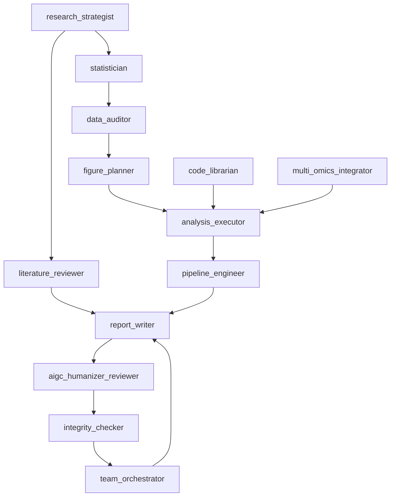
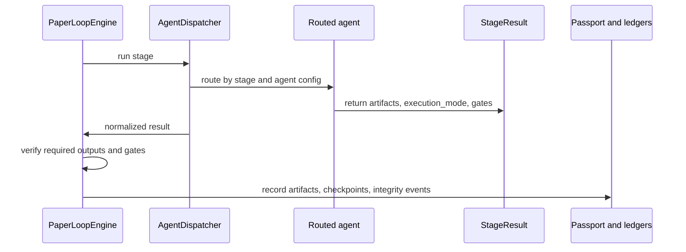

# Agent Roles v5.1

This document describes the current v5.1 collaboration model. Agent routing is
configured in `config/default_config.yaml`; scientific intent is compiled into
TargetTask by `paper_workflow.research_intent`; stage completion is verified
through `workflow_contract.yaml`, `StageResult`, and `PaperLoopEngine`.

## Research Team Overlay

v5.1 keeps the configured agents stable and presents them to researchers as a
role-based team. The overlay changes orchestration and responsibility, not the
truth layer or the configured agent identifiers.

| Research role | Configured agents | Responsibility |
|---|---|---|
| Principal investigator | `research_strategist` | Define the question, novelty target, claim boundary, and stop conditions; does not execute code. |
| Bioinformatics lead | `analysis_executor`, `code_librarian`, `multi_omics_integrator` | Translate the question into production-graded modules and an analysis graph. |
| Statistical reviewer | `statistician` | Protect the statistical unit, replicate structure, contrasts, covariates, and multiplicity control. |
| Data engineer | `data_auditor`, `pipeline_engineer` | Validate data registries, immutable inputs, environments, manifests, and reproducibility. |
| Manuscript scientist | `figure_planner`, `report_writer` | Build the figure story and evidence-bound methods/results packet. |
| Independent reviewer | `integrity_checker`, `team_orchestrator` | Apply fail-closed quality and reviewer-risk gates before claims advance. |

## Collaboration Model

## Primary Agents

| Agent | Owns | Main stages |
|---|---|---|
| `research_strategist` | Research direction, journal fit, feasibility, hypotheses | `select_topic`, `target_journal`, `formulate_hypotheses` |
| `literature_reviewer` | Literature substrate, BibTeX, citation evidence | `literature_search` |
| `statistician` | SAP, endpoint definition, independence assumptions | `design_analysis_plan`, `verify_methods` |
| `data_auditor` | Data inventory, quality, availability, statistical unit | `data_audit` |
| `figure_planner` | Figure logic, panels, evidence-to-figure mapping | `figure_planning` |
| `analysis_executor` | Computational outputs and run manifests | `run_analysis` |
| `pipeline_engineer` | Reproducibility, method verification, environment evidence | `verify_methods` |
| `report_writer` | Manuscript sections, assembly, revisions | `write_methods`, `write_results`, `write_introduction`, `write_discussion`, `assemble_manuscript`, `apply_revision` |
| `aigc_humanizer_reviewer` | Responsible AIGC hygiene scan and conservative revision plan | `aigc_humanizer_review` |
| `integrity_checker` | Quality gates, claim-evidence checks, final package checks | `integrity_check`, `finalize` |
| `team_orchestrator` | Internal review, re-review, cross-agent coordination | `internal_review`, `re_review` |
| `code_librarian` | Method-asset registry, code provenance, module contracts, reusable analysis inventory | supporting `design_analysis_plan`, `run_analysis`, `verify_methods`, `finalize` |
| `multi_omics_integrator` | Capability-aware multi-omics analysis graph design and evidence synthesis boundaries | supporting `design_analysis_plan`, `run_analysis`, `verify_methods` |

## Responsibility Boundaries

- Strategy agents do not invent data or mark downstream work complete.
- Literature agents do not fabricate references. Missing real BibTeX produces
  pending harness or needs-input state.
- Data and analysis agents do not write manuscript claims before outputs are
  verified.
- Code-library work must update `code_library/module_registry.yaml` and
  environment contracts before a module is treated as selectable or executable.
- Method planning must choose from declared data, environment, and module
  registries; common bioinformatics knowledge alone is not enough to claim a
  module is available.
- Graph execution writes node manifests and source maps, but the truth layer
  still decides whether `run_analysis` is complete.
- Writing agents must write from verified artifacts and preserve claim-evidence
  boundaries.
- Integrity agents report and route failures; they do not silently rewrite the
  evidence base.
- No agent can bypass `verify_stage()` or checkpoint requirements.

## Agent To Truth-Layer Flow

The truth layer, not the agent role description, decides whether the stage is
complete.
