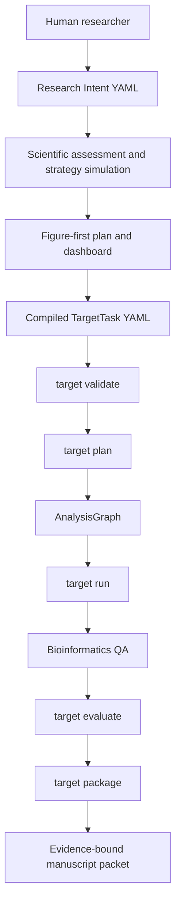

# ResearchPaperWorkflow v5.1 Architecture

v5 is organized around one invariant:

```text
scientific output = Research Intent + scientific strategy + TargetTask contract + executable graph + environment truth + source maps + fail-closed evaluation + claim boundary
```

The system still supports the broader paper workflow, but production analysis and manuscript-facing output now pass through the v5 production kernel.

## Control Flow



## Core Packages

| Package | Responsibility |
|---|---|
| `paper_workflow.research_intent` | Validates the scientific question, compares methods, applies experience reminders, plans figures, compiles TargetTask, and writes the dashboard. |
| `paper_workflow.target_task` | Loads TargetTask YAML, validates schema, plans graph, runs or blocks execution, writes target package. |
| `paper_workflow.bioinformatics` | Module registry, environment registry, strategy evaluation, graph execution, run-specific QA. |
| `paper_workflow.outputs` | Run layout, source-map validation, evaluation reports, fail-closed status. |
| `paper_workflow.manuscript` | Converts verified evidence into Methods, Results skeleton, figure storyline, and claim ledger. |
| `paper_workflow.monitoring` | Productivity scorecard and release gate ledger. |

## Fail-Closed Semantics

`pass` is allowed only when all required gates pass. The following produce `needs_fix` or `blocked`:

- missing `figure_source_map.yaml` or `table_source_map.yaml`;
- missing `claim_boundary` in any source-map item;
- missing `logs/sessionInfo.txt` for executed R modules;
- missing data registry hash for production execution;
- Windows personal paths in generated artifacts;
- environment package/runner failure when `--execute` is requested;
- adapter, scaffold, or planning-only modules selected as primary production modules.

The fail-closed decision is persisted at:

```text
results/runs/<run_id>/qc/fail_closed_decision.yaml
```

## Module Production Grading

Every `code_library/module_registry.yaml` entry has explicit v5 fields:

- `production_capability_grade`
- `execution_evidence_level`
- `strategy_visibility`
- `claim_permission`
- `current_environment_status`

`ModuleRegistry.production_gate()` is the local truth for whether a module can enter a production-visible graph. Environment-blocked modules remain visible in audit reports but cannot pass the production gate.

## TargetTask Artifact Layout

Before TargetTask execution, the researcher layer writes:

```text
papers/<project_id>/research_plan/
  research_intent_resolved.yaml
  scientific_assessment.yaml
  strategy_simulation.yaml
  figure_plan.yaml
  FIGURE_PLAN.md
  target_task.yaml
  research_dashboard.yaml
  RESEARCH_DASHBOARD.md
```

A TargetTask run writes:

```text
papers/<target_name>/results/runs/<target_id>/
  analysis_graph.yaml
  target_task_resolved.yaml
  strategy_decision.yaml
  evaluation_report.yaml
  qc/bioinformatics_quality_report.yaml
  qc/fail_closed_decision.yaml
  tables/evidence_matrix.tsv
  brief/FIGURE_STORYLINE.md
  manuscript/methods_draft.md
  manuscript/results_skeleton.md
  claims/claim_ledger.jsonl
  review/reviewer_risk_report.md
```

`results_skeleton.md` is intentionally conservative. If final status is not `pass`, it records the blocked state and does not generate a conclusion paragraph.

## PBMC3K Validation Fixture

`targets/examples/pbmc3k_t_subcluster_v5.yaml` is the v5 reference TargetTask. It wires:

1. `single_cell.seurat_pbmc3k_basic.v1`
2. `single_cell.seurat_subcluster_programs.v1`

The fixture validates workflow mechanics on official tutorial data. Its claim boundary forbids disease, clinical, treatment-response, and causal immune-state claims.

## Release Gates

Before release:

```bash
python -m compileall -q src scripts tests
python scripts/ci_quality_check.py --json
python scripts/ci_module_grade_audit.py --strict --json
python scripts/ci_supervision_failure_cases.py --json
python scripts/ci_graph_dry_run.py --json
python scripts/ci_pbmc3k_target_task.py --json
python scripts/ci_performance_budget.py --json
python -m pytest -q
```

R checks are environment-dependent and should be reported separately:

```bash
Rscript scripts/check_r_environment.R --json
Rscript scripts/ci_seurat_subcluster_smoke.R
```
