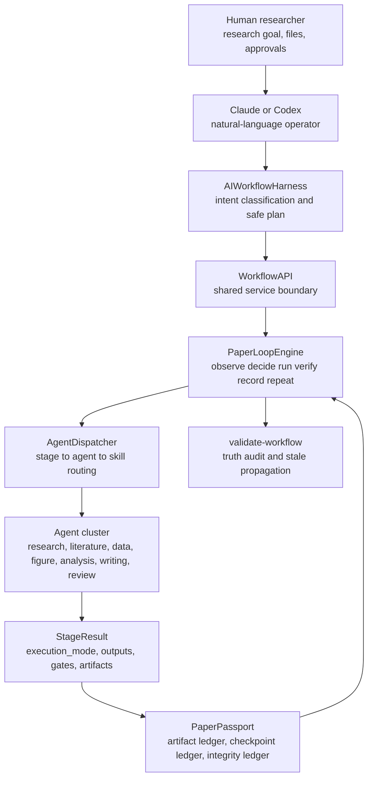
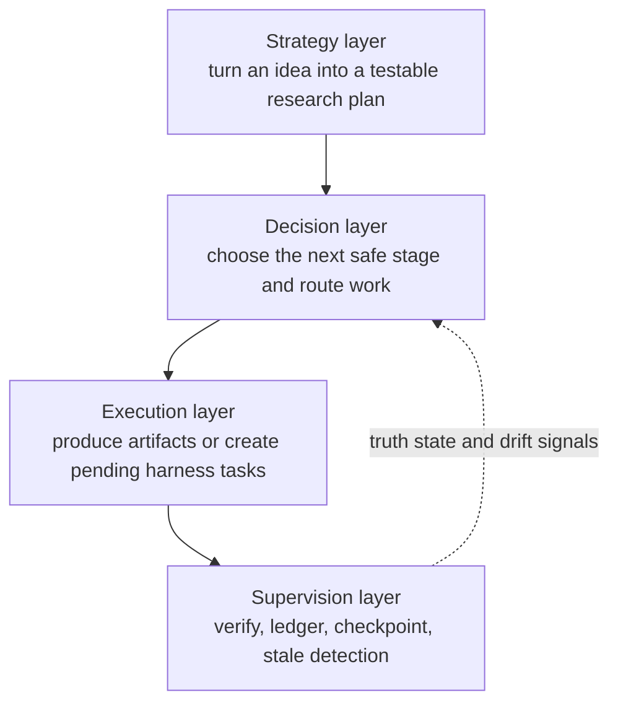
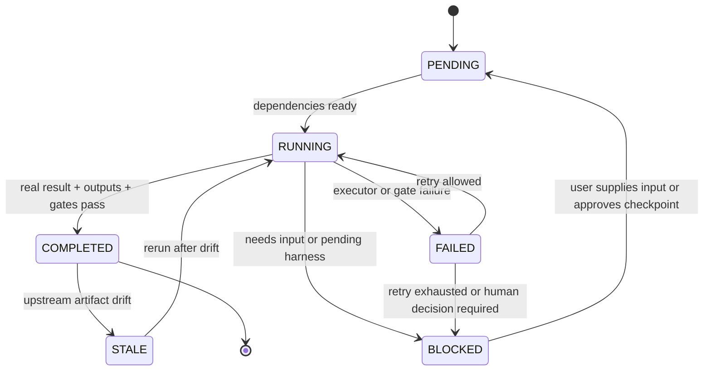
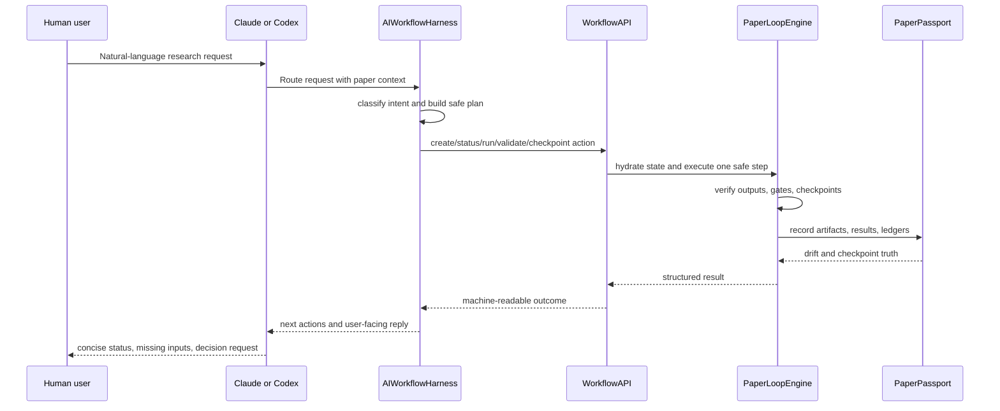
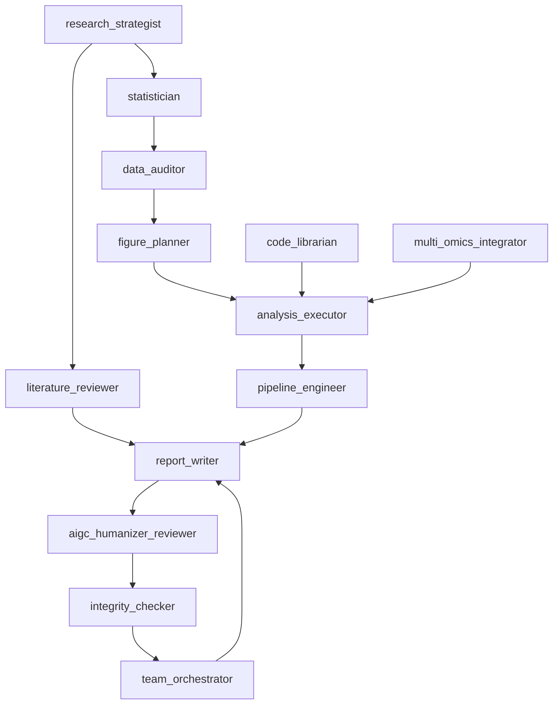
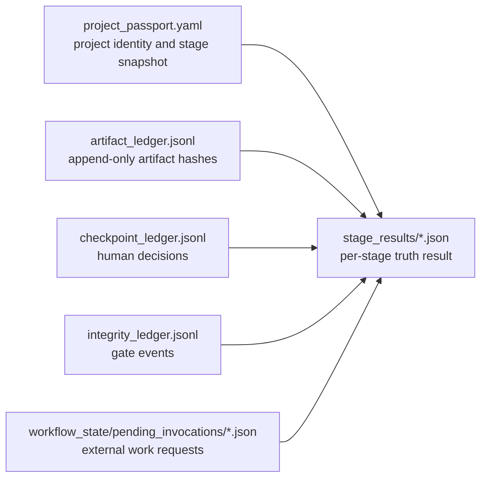
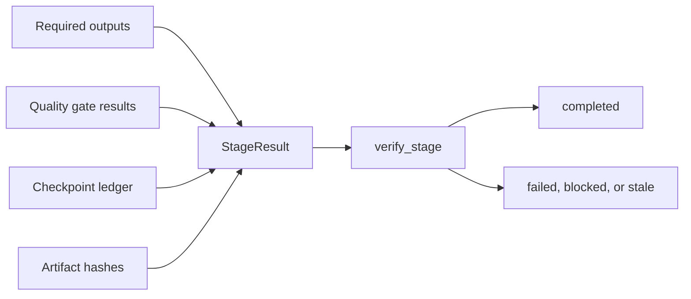

# ResearchPaperWorkflow Architecture v4.3

ResearchPaperWorkflow is an auditable research-production workflow for
bioinformatics, clinical, single-cell, spatial, and other evidence-heavy
manuscript projects. The current design is V4.3. It replaces the older
pre-truth-layer scaffold with a 20-stage truth-layer pipeline where a stage is
complete only when the required artifacts, gate results, checkpoint state, and
stage result files agree.

The system is designed for Claude, Codex, or another tool-using AI model to act
as the operator. The human user describes the scientific goal, supplies data or
files, reviews checkpoints, and approves decisions. The workflow engine keeps
the machine-readable state.

## Current Contract

The central invariant is:

```text
completed = real execution + verified outputs + concrete gate results + checkpoint consistency
```

The machine-readable contract is `workflow_contract.yaml`. It defines each
stage's required outputs, quality gates, transition policy, and executor mode.
The runtime uses this contract through `PaperLoopEngine.verify_stage()`, not as
documentation only.

Completion is rejected when:

- a required output is missing or empty;
- the stage result says `template`, `pending_harness`, or `needs_input`;
- a critical or high quality gate was configured but did not produce a concrete
  pass result;
- a checkpoint stage has not been explicitly approved;
- an upstream artifact drifted and the dependent stage is stale.

## System Overview



The important design choice is that the AI harness is intentionally thin. It
does not decide that work is complete. It translates a user's request into a
safe workflow action, then the API and loop engine perform the same verification
used by direct CLI and Python callers.

## Four-Layer Control Model



| Layer | Main files | Responsibility | What it must not do |
|---|---|---|---|
| Strategy | `src/paper_workflow/strategy/`, `src/paper_workflow/workflow.py` | Convert a research idea into topic, target journal, feasibility, hypotheses, and initial paper state. | Mark downstream analysis or writing complete. |
| Decision | `src/paper_workflow/engine/loop_engine.py`, `workflow_contract.yaml` | Hydrate state, choose the next eligible stage, enforce dependencies, checkpoints, and transitions. | Bypass required outputs or gates. |
| Execution | `src/paper_workflow/engine/agent_dispatcher.py`, `src/paper_workflow/engine/agent_harness.py`, `src/paper_workflow/cli/`, `src/paper_workflow/api.py` | Run stage handlers, route to agents and skills, create real artifacts or explicit pending harness records. | Treat placeholders as success. |
| Supervision | `src/paper_workflow/supervision/`, `src/paper_workflow/outputs/stage_result.py` | Record artifacts, hashes, checkpoints, integrity events, quality results, and workflow validation. | Mutate scientific content without routing through a stage. |

The layers are logical boundaries, not isolated services. `PaperLoopEngine`
bridges decision and execution because it both selects the next stage and
verifies the result after execution. The verification path remains single and
auditable.

## V4.3 20-Stage Pipeline


| # | Stage | Main agent | Required truth output |
|---:|---|---|---|
| 1 | `select_topic` | `research_strategist` | `research_plan/research_question.md`, `research_plan/hypotheses.yaml` |
| 2 | `target_journal` | `research_strategist` | `research_plan/journal_profile.md` |
| 3 | `literature_search` | `literature_reviewer` | `references/library.bib` |
| 4 | `formulate_hypotheses` | `research_strategist` | `research_plan/feasibility_decision.md` |
| 5 | `design_analysis_plan` | `statistician` | SAP, study protocol, causal-assumption audit |
| 6 | `data_audit` | `data_auditor` | data audit report, data inventory |
| 7 | `figure_planning` | `figure_planner` | figure plan, figure specs |
| 8 | `run_analysis` | `analysis_executor` | `results/run_manifest.yaml` |
| 9 | `verify_methods` | `pipeline_engineer` | `methods/run_manifest.yaml` |
| 10 | `write_methods` | `report_writer` | `manuscript/methods.md` |
| 11 | `write_results` | `report_writer` | `manuscript/results.md` |
| 12 | `write_introduction` | `report_writer` | `manuscript/introduction.md` |
| 13 | `write_discussion` | `report_writer` | `manuscript/discussion.md` |
| 14 | `assemble_manuscript` | `report_writer` | `manuscript/manuscript_full.md` |
| 15 | `aigc_humanizer_review` | `aigc_humanizer_reviewer` | AIGC report, revision plan, humanized manuscript |
| 16 | `integrity_check` | `integrity_checker` | JSON and Markdown integrity reports |
| 17 | `internal_review` | `team_orchestrator` | internal review report |
| 18 | `apply_revision` | `report_writer` | revised manuscript |
| 19 | `re_review` | `team_orchestrator` | re-review report |
| 20 | `finalize` | `integrity_checker` | final manuscript, cover letter, data and code statements |

## Loop State Machine

The loop model is:

```text
observe -> decide -> run -> verify -> record -> mark_stale -> diagnose -> repeat
```



Stage states:

- `pending`: not yet eligible or not yet run.
- `running`: currently executing.
- `completed`: verified by the truth layer.
- `failed`: execution or quality gate failed.
- `stale`: output was previously valid but an upstream dependency changed.
- `skipped`: intentionally skipped for a supported paper type.
- `blocked`: waiting for input, checkpoint approval, or external harness output.

Pipeline states:

- `clean`: no unresolved failure or drift is known.
- `in_progress`: the workflow is advancing.
- `checkpoint_required`: a human decision is required.
- `gate_failure`: one or more quality gates failed.
- `drift_detected`: artifact hashes changed.
- `stale_stages`: downstream stages have been invalidated.
- `blocked`: progress is impossible until input or human decision arrives.

## AI Harness Architecture



Supported AI harness intents include project creation, status, one-step
pipeline advance, contract validation, workflow validation, checkpoint approval,
pending harness listing, harness completion, integrity gate runs, AIGC hygiene
review, failure diagnosis, and paper listing.

The harness defaults are conservative:

- one stage per model turn;
- stop on failure;
- do not auto-approve checkpoints;
- require explicit `paper_id` unless exactly one project exists;
- preserve the normal `WorkflowAPI -> PaperLoopEngine -> verify_stage` path;
- never promote pending harness work into completed stage truth.

## Agent Cluster



Primary routed agents:

- `research_strategist`: topic, journal, feasibility, hypotheses.
- `literature_reviewer`: reference search, citation substrate, literature gaps.
- `statistician`: SAP, endpoint, independence, statistical assumptions.
- `data_auditor`: input data inventory, availability, quality limitations.
- `figure_planner`: figure plan, panel logic, figure evidence map.
- `analysis_executor`: computational analysis outputs and manifests.
- `pipeline_engineer`: reproducibility, method verification, run manifests.
- `report_writer`: manuscript sections, assembly, revision.
- `aigc_humanizer_reviewer`: responsible AIGC hygiene report and conservative revision plan.
- `integrity_checker`: citation, claim, reporting, data and code availability gates.
- `team_orchestrator`: internal review, re-review, multi-agent coordination.
- `code_librarian`: code provenance and reusable analysis script inventory.
- `multi_omics_integrator`: modality-specific analysis support for multi-omics projects.

## Task, Version, And Progress Preservation

Every paper project lives under `papers/<paper_id>/`. The generated project is
not a loose folder of drafts; it is an event-sourced research state.



The important persistence rules are:

- `project_passport.yaml` holds the project identity and current stage snapshot.
- `stage_results/<stage>_result.json` records the normalized `StageResult`.
- `artifact_ledger.jsonl` is append-only and stores SHA-256 hashes.
- `checkpoint_ledger.jsonl` records explicit human approvals or revision decisions.
- `integrity_ledger.jsonl` stores quality-gate events.
- `workflow_state/pending_invocations/` records external or human work that is
  required before a stage can become real.
- `WorkflowAPI.status()` and `PaperLoopEngine` hydrate state from those records,
  so status, resume, and validation reconstruct the same truth.

## Quality Gates And Information Chain



Gate categories are tuned for biomedical and bioinformatics risks:

- statistical analysis plan exists before primary analysis;
- endpoint definition is complete;
- patient-level, donor-level, or subject-level independence is preserved;
- pseudoreplication is blocked where biological-unit inference is claimed;
- results claims are bound to artifacts and statistics;
- Results sections avoid unsupported citations or overinterpretation;
- local paths and private machine artifacts are removed from Methods;
- citation targets exist in BibTeX;
- data and code availability statements are present;
- AIGC hygiene detects model-interface artifacts and formulaic style density.

Critical and high gates are fail-closed. A missing gate result is not a pass.

## Human In The Loop

The system deliberately keeps human review at scientific decision points:

- research direction and scope;
- target journal suitability when needed;
- hypothesis feasibility and testability;
- SAP freeze before primary analysis;
- figure plan and claim structure;
- Methods and Results acceptance;
- AIGC hygiene decision;
- internal review and revision routing;
- final submission package.

Human approval is not a comment in chat. It is a checkpoint ledger entry that
the engine can verify on resume.

## Artifact Drift And Resume

The supervision layer recalculates hashes for recorded artifacts. When an
upstream artifact changes, the dependency map marks downstream stages `stale`.
That means a manuscript section written from an older run manifest cannot remain
completed after the analysis manifest changes.

Resume uses the same truth sources:

1. load `project_passport.yaml`;
2. load stage result files;
3. compare artifact ledger hashes;
4. apply checkpoint blockers;
5. apply drift and stale propagation;
6. choose the next eligible stage.

## Validation Surfaces

Production readiness is checked at two levels:

- Contract validation: config, contract, engine stages, dispatcher handlers,
  quality gate references, agent routing, and AI harness command catalog agree.
- Workflow validation: a concrete paper project has consistent stage state,
  non-empty required outputs, concrete gate results, no incorrect completed
  pending harness stages, and no unpropagated drift.

## Design Principle

V4.3 follows a minimal, truth-first design. It does not try to become a fully
autonomous paper factory. It first makes the facts hard:

- real artifacts before completion;
- fail-closed quality gates;
- explicit human decisions;
- resumable state;
- auditable agent routing;
- no silent promotion of templates or pending work.

The result is a workflow kernel that is suitable for research supervision:
Codex or Claude can operate it, but the state remains inspectable by a human
researcher and recoverable from files.
