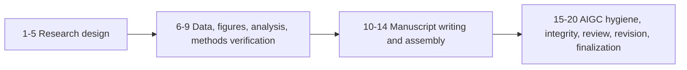

# Research Paper Workflow Framework v4.4

Agent-operated research paper workflow for bioinformatics, clinical research,
and reproducible manuscript production. V4.4 keeps the V4.3 truth-layer
architecture and adds clinical research collaboration modes, run-scoped result
management, bounded analysis execution, code-library routing, and CI preflight.

[](https://www.python.org/)
[](LICENSE)
[](tests/)
[]()

## What V4.4 Is

ResearchPaperWorkflow is not a prompt pack that asks an AI to write a paper in
one pass. It is an auditable workflow kernel where Claude, Codex, or another
tool-using AI agent can operate a research pipeline while the user supplies
scientific judgment, data, references, and approvals.

The current invariant is:

```text
completed = real execution + verified outputs + concrete gate results + checkpoint consistency
```

## V4.4 Additions

- Lightweight collaboration modes:
  `exploration_mode`, `analysis_design_mode`, `execution_mode`,
  `closeout_audit_mode`, `ppt_briefing_mode`, and `retrospective_mode`.
- Run-scoped output layout under `results/runs/<run_id>/` with
  `results/current_run.yaml` and `results/current/RUN_POINTER.txt`.
- Analysis-design-first CLI flow: `new-run`, `set-current-run`,
  `plan-analysis`, `run-analysis`, `brief-status`, and `evaluate-run`.
- Built-in bulk RNA-seq pilot backend for workflow smoke execution, source-map
  generation, QC reports, and preview figures without external bioinformatics
  package installation.
- Contract files for result writing, visualization, bioinformatics methods,
  reporting, workflow modes, and curated code-library routing.
- CI preflight for YAML/config validation, large-file guards, CLI smoke, and
  pytest.

## Highlights

- 20-stage V4 paper loop from topic design to final submission package.
- Machine-readable truth contract in `workflow_contract.yaml`.
- Fail-closed stage verification: templates, pending harness records, empty
  files, and missing quality-gate results cannot become completed stages.
- Shared `WorkflowAPI` service boundary for CLI, AI harness, Python callers,
  and non-dry-run E2E compatibility.
- Model-facing AI harness for natural-language Claude/Codex operation.
- Unified `StageResult` files under `stage_results/` for audit and resume.
- Passport and ledger supervision: artifact hashes, checkpoints, integrity
  events, pending harness records, and stale propagation.
- 13-agent routing model covering strategy, literature, statistics, data,
  figures, analysis, writing, AIGC hygiene, integrity, and review.
- Biomedical safeguards for SAP freeze, patient-level independence,
  pseudoreplication, claim-evidence binding, conservative interpretation, data
  availability, code availability, and responsible AIGC text hygiene.

## Claude/Codex First Workflow

Most research users should interact with the workflow through natural language.
The model calls the harness and reports the result.

Example user request:

```text
I have not started yet. I want to design a clinical bioinformatics project about
diabetes and clear cell renal cell carcinoma using single-cell or spatial
transcriptomics. Target journal: Genome Biology. Create the workflow project,
advance only to the first checkpoint, and tell me what scientific decision I
need to approve.
```

Example continuation request:

```text
Continue this paper by one safe workflow step. Stop if there is a checkpoint,
quality-gate failure, pending harness task, missing artifact, or stale
downstream stage. Report the paper_id, current stage truth, missing inputs, and
next safest action.
```

Example validation request:

```text
Audit the current workflow state. Check whether completed stages have real
stage results, non-empty required outputs, concrete quality-gate results,
checkpoint approval where required, and no unpropagated artifact drift.
```

For detailed Chinese natural-language prompt patterns, see
[V4.3 Chinese operation guide](docs/OPERATION_GUIDE_ZH.md).

## Maintainer CLI

The CLI remains available for maintainers, tests, and automation. The important
rule is that all supported entrypoints use the same truth path:

```text
AIWorkflowHarness -> WorkflowAPI -> PaperLoopEngine -> verify_stage -> passport/ledger/stage_results
```

Core commands:

```text
ai
ai-harness
create-project
status
run-pipeline
checkpoint
run-integrity-gate
diagnose-gate-failures
detect-artifact-drift
sync-artifact-stale
validate-workflow
validate-contract
list-harness-invocations
complete-harness-invocation
list-papers
strategy
install-skills
run-aigc-humanizer
new-run
set-current-run
plan-analysis
run-analysis
brief-status
evaluate-run
```

## 20-Stage Pipeline



Stages:

1. `select_topic`
2. `target_journal`
3. `literature_search`
4. `formulate_hypotheses`
5. `design_analysis_plan`
6. `data_audit`
7. `figure_planning`
8. `run_analysis`
9. `verify_methods`
10. `write_methods`
11. `write_results`
12. `write_introduction`
13. `write_discussion`
14. `assemble_manuscript`
15. `aigc_humanizer_review`
16. `integrity_check`
17. `internal_review`
18. `apply_revision`
19. `re_review`
20. `finalize`

## Project Truth Files

Generated paper projects store recoverable state under `papers/<paper_id>/`:

- `project_passport.yaml`: project identity and stage snapshot.
- `stage_results/*_result.json`: normalized result for each stage.
- `artifact_ledger.jsonl`: append-only artifact hashes.
- `checkpoint_ledger.jsonl`: human approvals and revision decisions.
- `integrity_ledger.jsonl`: quality-gate events.
- `workflow_state/pending_invocations/*.json`: external or human work required
  before a stage can complete.

## Documentation

- [V4.3 architecture](ARCHITECTURE.md)
- [V4.3 user guide](USER_GUIDE.md)
- [V4.3 Chinese operation guide](docs/OPERATION_GUIDE_ZH.md)
- [V4.4 clinical research Codex workflow guide](docs/CLINICAL_RESEARCH_CODEX_WORKFLOW_GUIDE.md)
- [V4.4 Codex collaboration system](docs/CODEX_COLLABORATION_SYSTEM.md)
- [V4.4 optimization master plan](docs/WORKFLOW_OPTIMIZATION_MASTER_PLAN_2026-07-07.md)
- [Release notes v4.4.0](docs/RELEASE_NOTES_v4.4.0.md)
- [Next-generation truth-layer guide](docs/NEXT_GEN_V4_TRUTH_LAYER.md)
- [Next-generation completion audit](docs/NEXT_GEN_COMPLETION_AUDIT.md)
- [Release notes v4.3.0](docs/RELEASE_NOTES_v4.3.0.md)
- [Release notes v4.2.0](docs/RELEASE_NOTES_v4.2.0.md)
- [Release notes v4.1.0](docs/RELEASE_NOTES_v4.1.0.md)

Backward-compatible links:

- [AI harness interaction guide](docs/AI_HARNESS_INTERACTION_GUIDE_ZH.md)
- [Clinician and graduate student guide](docs/CLINICIAN_GRADUATE_USER_GUIDE_ZH.md)

Those two files now point to the unified V4.3 Chinese operation guide.

## Verification

Recommended maintainer checks:

```bash
python -m compileall -q src
python scripts/ci_quality_check.py
python scripts/ci_cli_smoke.py
python -m pytest -q
python -m paper_workflow.cli validate-contract --strict
```

Current v4.4 local preflight: compileall passed, CI quality passed with 0
issues, CLI smoke passed, and `79 passed` under pytest.

## License

MIT License. See [LICENSE](LICENSE).
