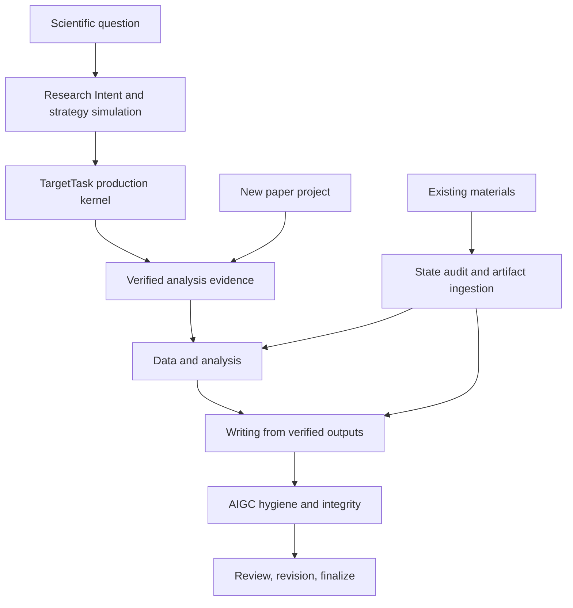

# Workflow Patterns v5.1

v5.1 patterns start from Research Intent for scientific analysis and retain the
20-stage PaperLoop for manuscript lifecycle control. The model may call the AI
harness, but the user supplies scientific decisions and execution approval.
All patterns preserve the same fail-closed truth path.

## Pattern Map



## Pattern 0: Rapid Scientific Intent

Use when the researcher knows the question and data context but should not need
to choose module identifiers.

```text
Compile this research_intent.yaml into a scientific assessment, method
alternatives, Figure-first plan, TargetTask, and dashboard. Do not execute
until I review the blockers and approve the target.
```

Expected boundary:

- statistical unit and missing replicate metadata are explicit;
- recommended, deferred, and planning-only methods are separated;
- the figure story precedes downstream module stacking;
- real execution still requires TargetTask approval and all production gates.

## Pattern 1: New Project

Use when the user has only a research idea.

Natural-language request:

```text
Create a ResearchPaperWorkflow project for [topic], target [journal], and stop
at the first checkpoint. Report the paper_id, research question, missing inputs,
and decision I need to approve.
```

Expected boundary:

- project passport created;
- topic and hypothesis artifacts created;
- human approval required before downstream progress.

## Pattern 2: Research Design And SAP

Use when the topic exists but analysis design is not frozen.

Natural-language request:

```text
Advance through journal fit, literature substrate, hypothesis formulation, and
SAP design. Stop if references, endpoint definitions, statistical unit, or
patient-level independence are missing.
```

Expected boundary:

- no primary analysis before SAP;
- no empty reference library;
- no completion when critical gates are unrun.

## Pattern 3: Existing Data Or Results

Use when the user already has files.

Natural-language request:

```text
Audit my existing data and results, map them to required workflow artifacts,
mark stale downstream stages if upstream files changed, and do not write the
paper until the run manifest and methods verification are valid.
```

Expected boundary:

- data inventory and statistical unit recorded;
- figure plan aligned to outputs;
- analysis manifest verified;
- writing remains blocked until methods verification passes.

## Pattern 4: Manuscript Writing

Use when analysis artifacts are verified.

Natural-language request:

```text
Write Methods and Results from verified artifacts only. Keep claims
conservative, preserve limitations, and stop at section checkpoints.
```

Expected boundary:

- Methods parameters match run evidence;
- Results claims bind to artifacts and statistics;
- Discussion handles interpretation and limitations, not unsupported causality.

## Pattern 5: Submission QA

Use when the manuscript is assembled.

Natural-language request:

```text
Run AIGC hygiene, integrity checks, internal review, revision routing, re-review,
and final package preparation. Do not finalize until data availability, code
availability, citations, and claim-evidence binding are valid.
```

Expected boundary:

- AIGC hygiene is recorded as an audit and conservative revision plan;
- integrity failures block finalization;
- final package includes manuscript, cover letter, data availability, and code
  availability statements.

## Pattern 6: Recovery And Resume

Use after interruption, manual edits, or cross-agent work.

Natural-language request:

```text
Reconstruct the workflow state from passport, stage results, ledgers, and
artifact hashes. Tell me which stages are completed, blocked, stale, or failed,
and what the next safest step is.
```

Expected boundary:

- status is hydrated from files, not memory;
- drift marks downstream stages stale;
- pending harness work stays pending until required outputs are verified.
