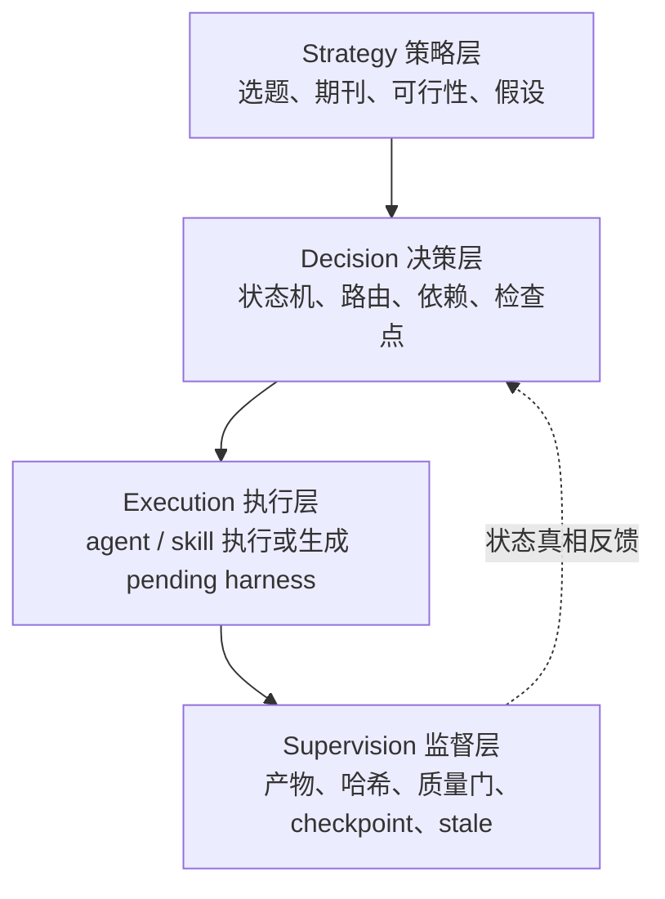
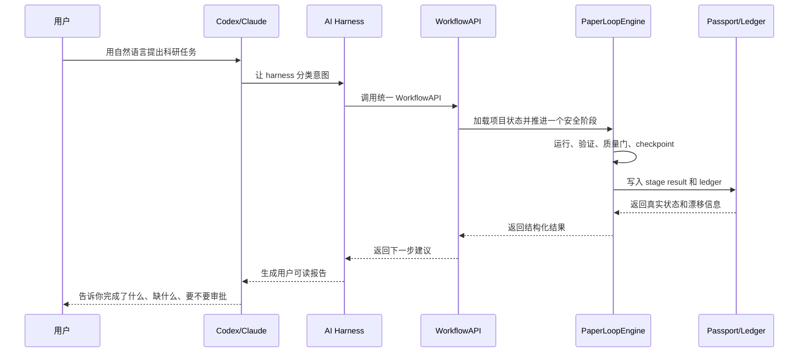

# ResearchPaperWorkflow V4.3 中文操作指南

本指南合并原来的 AI harness interaction guide 和 clinician / graduate student
guide。目标读者是医生、研究生、生信分析人员和使用 Codex / Claude 的科研作者。

普通用户不需要记 Python 命令。你只需要用自然语言告诉 Codex 或 Claude：

- 你现在处于哪个研究阶段；
- 你有什么材料；
- 你想推进到哪里；
- 哪些科学边界不能越过；
- 哪些节点必须停下来让你审阅。

模型负责调用工作流 harness，工作流负责保存状态、验证产物、触发质量门和恢复进度。

## 一句话理解

ResearchPaperWorkflow 不是“让 AI 一口气写完论文”的提示词库，而是一个可审计的科研工作流内核。

核心原则：

```text
completed = 真实执行 + 必需产物存在且非空 + 质量门真实通过 + 人工检查点一致
```

如果一个阶段只是模板、占位符、空文件、等待外部 agent、等待你补材料，它不能被标记为完成。

## 你、模型、工作流分别负责什么

| 角色 | 负责什么 |
|---|---|
| 你 | 定义科学问题、提供数据和参考文献、审阅关键节点、批准或驳回继续推进。 |
| Codex / Claude | 理解你的自然语言需求，调用 harness，推进一个安全步骤，报告缺口和下一步。 |
| WorkflowAPI | 统一入口，保证 CLI、AI harness、Python 调用走同一条状态真相路径。 |
| PaperLoopEngine | 状态机核心，决定下一阶段、运行、验证、记录、处理 stale 和失败。 |
| Agent 集群 | 由不同专业 agent 负责选题、文献、SAP、数据、图表、分析、写作、审稿和完整性检查。 |
| Supervision 层 | 记录 passport、artifact ledger、checkpoint ledger、integrity ledger 和 stage result。 |

## 四层调控



### Strategy 策略层

把模糊想法变成可执行研究方案。

你可以这样说：

```text
我想做一个肾癌和糖尿病相关的临床生信课题，可能用单细胞或空间转录组。请先帮我建立研究方向、目标期刊匹配和初步假设，不要直接开始写论文。
```

### Decision 决策层

决定下一步能不能走、该走哪一步、是否必须停下来。

你可以这样说：

```text
请检查当前 paper_id 的状态，告诉我下一步是否可以推进。如果有 checkpoint、pending harness、stale 或质量门失败，请先报告，不要强行继续。
```

### Execution 执行层

执行具体阶段，或者在缺少真实材料时生成待办。

你可以这样说：

```text
请推进一个阶段。如果 literature_search 需要真实参考文献，请列出需要我补充的 BibTeX 或检索结果，不要生成空引用库冒充完成。
```

### Supervision 监督层

保存证据、追踪产物、检查漂移、验证完成。

你可以这样说：

```text
请做一次 workflow 体检，核对 completed 阶段是否都有真实产物、stage result、质量门结果和 checkpoint 记录。
```

## 20 个阶段如何走


### 1-5 研究设计

目标是把研究问题先变硬，再进入数据和写作。

适合的自然语言请求：

```text
我还没有正式开始，请从选题和可行性开始。目标是医学或生信论文，不要写正文。先输出研究问题、期刊适配、文献缺口、假设和 SAP 所需信息，遇到人工检查点就停。
```

关键产物：

- research question；
- journal profile；
- references library；
- feasibility decision；
- statistical analysis plan；
- study design protocol；
- causal assumption audit。

### 6-9 数据与分析

目标是确认数据、图表、分析结果和方法可复现。

适合的自然语言请求：

```text
我已经有部分数据和分析输出。请先做数据审计，确认统计单位、样本来源、缺失项、可复现性和分析输出清单。不要直接写 Results。
```

关键要求：

- 明确统计单位是 patient、donor、subject、sample、cell 还是 spot；
- 不能把细胞数或 spot 数当作患者数；
- analysis outputs 必须进入 run manifest；
- 方法验证必须读 SAP、data inventory 和 run manifest。

### 10-14 写作组装

目标是从已验证产物写正文，而不是凭空生成论文。

适合的自然语言请求：

```text
请只根据已验证的 SAP、数据审计、run manifest、figure plan 和真实结果写 Methods / Results。不能把探索性发现写成因果结论，不能把模型关联写成临床可用 biomarker。
```

关键要求：

- Methods 参数完整；
- Results claims 绑定图表和统计结果；
- Results 不堆引用；
- Introduction 和 Discussion 的引用必须能在 BibTeX 中找到；
- Discussion 必须写限制，不能过度解释。

### 15-20 质控、修订、投稿

目标是让投稿包可审计。

适合的自然语言请求：

```text
请进入投稿前质控：先做 AIGC 文本卫生检查，再做完整性检查和内部审稿。列出所有阻塞问题和需要我批准的修订，不要跳过 review 直接 finalize。
```

关键产物：

- AIGC detection report；
- humanizer revision plan；
- integrity report；
- internal review；
- revised manuscript；
- re-review report；
- final manuscript；
- cover letter；
- data availability statement；
- code availability statement。

## Harness 如何工作



你可以把 Codex / Claude 当作操作员，但不能把聊天记录当作真相。真相在：

- `project_passport.yaml`；
- `stage_results/*_result.json`；
- `artifact_ledger.jsonl`；
- `checkpoint_ledger.jsonl`；
- `integrity_ledger.jsonl`；
- `workflow_state/pending_invocations/*.json`。

## 典型对话范式

### 新建课题

```text
我还没有开始。请为一个 [疾病/场景] + [数据类型] + [目标期刊] 的研究方向建立 ResearchPaperWorkflow 项目。只推进到第一个需要我审阅的 checkpoint，并报告 paper_id、初始研究问题、主要假设、缺失输入和下一步选择。
```

### 继续已有项目

```text
请继续 paper_id 为 [paper_id] 的项目。每次只推进一个阶段。遇到 checkpoint、质量门失败、pending harness 或 artifact drift 就停下来，并用表格告诉我原因、缺什么、下一步我该做什么。
```

### 接入已有材料

```text
我已经有部分材料，包括 [数据路径/结果文件/草稿/参考文献]。请先做状态体检和材料映射，把能接入 workflow 的产物列出来，判断哪些阶段可以恢复，哪些阶段必须标记为 stale 或 needs_input。
```

### 质量门审查

```text
请从科研审稿角度检查当前 workflow：SAP 是否冻结，patient-level independence 是否成立，pseudoreplication 是否存在，Results claim 是否有图表和统计支持，Discussion 是否过度解释。
```

### 人工批准 checkpoint

```text
我批准 [stage] checkpoint。批准条件是：[明确统计单位、endpoint、限制、不能越过的 claim 边界]。请记录这个决定，然后只推进下一步。
```

### 驳回 checkpoint

```text
我不批准 [stage] checkpoint。原因是：[具体科学问题]。请生成修订计划并停在当前阶段，不要推进下游。
```

### 投稿前 closeout

```text
请做投稿前 closeout：列出所有 completed 阶段的证据、未解决的 gate failure、pending harness、stale stage、数据和代码可用性、AIGC hygiene 结果、需要我最终确认的问题。
```

## 如何判断模型有没有正确使用 workflow

正确行为：

- 报告 `paper_id`；
- 报告当前 stage 和 pipeline state；
- 说明哪些产物是真实存在的；
- 遇到缺失输入时返回 `needs_input` 或 `pending_harness`；
- 遇到检查点时停下来让你审批；
- 遇到质量门失败时解释失败项；
- 不把模板、空文件或占位内容当成完成。

错误行为：

- 直接说“论文已完成”但没有列出 stage results；
- 用空参考文献继续写 Introduction；
- 在 SAP 未冻结前开始主要分析；
- 把细胞级分析写成患者级结论；
- 把相关性写成因果；
- 跳过 AIGC hygiene、integrity check 或 internal review；
- 只在聊天里说“已批准”，但没有 checkpoint 记录。

## 科研优势

V4.3 对医学和生信科研的价值在于：

- 把模糊写作流程拆成可恢复的阶段；
- 把产物、质量门、人工决策和版本进度绑定；
- 先冻结 SAP，再进入数据分析，减少事后假设；
- 对 patient-level independence 和 pseudoreplication fail-closed；
- 对 claim-evidence 绑定进行持续检查；
- 对 AIGC 文本卫生做负责任审查，而不是简单追求检测器分数；
- 让 Codex / Claude 能执行流程，但不能绕过状态机和质量门；
- 每次中断后都能从 passport 和 stage result 恢复同一套真相。

## 推荐让模型每轮汇报的格式

```text
请按以下格式汇报：
1. 当前 paper_id 和 pipeline state
2. 本轮推进的 stage
3. 新增或修改的 artifacts
4. 质量门通过/失败情况
5. checkpoint 是否需要我审批
6. pending harness 或 needs_input
7. 是否有 artifact drift 或 stale stage
8. 下一步最安全操作
```

这个 closeout 比长篇解释更重要，因为它决定项目能否跨会话、跨模型继续推进。
